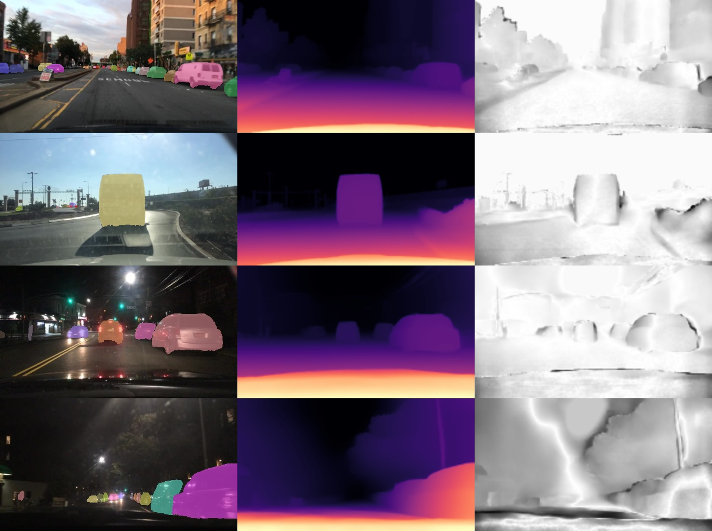
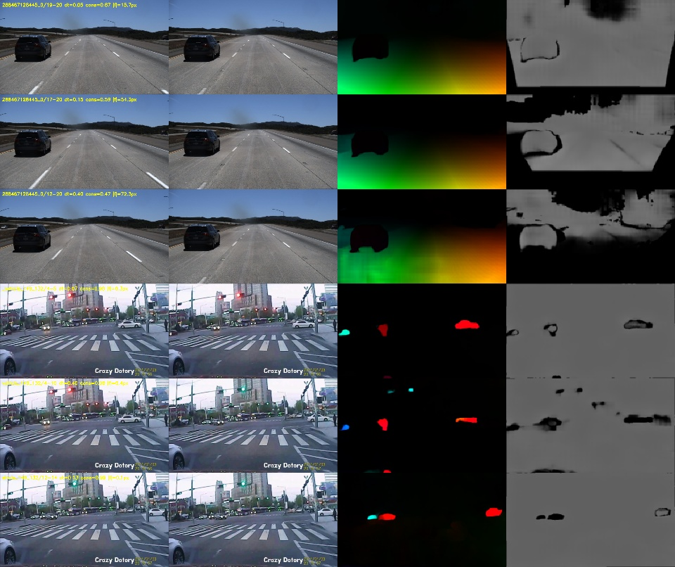
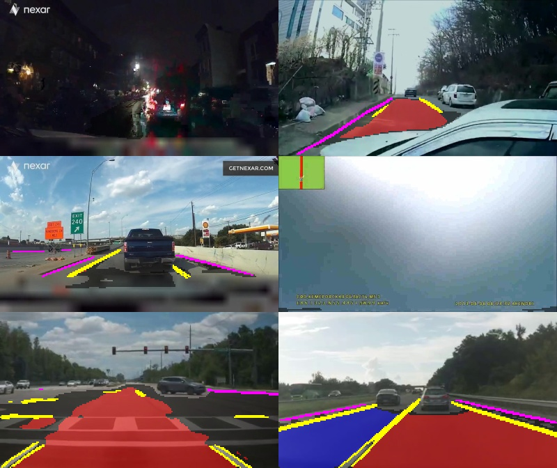
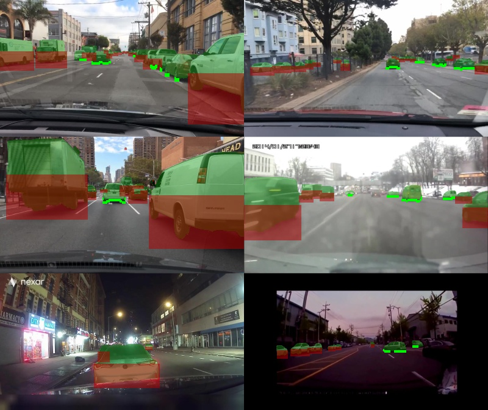
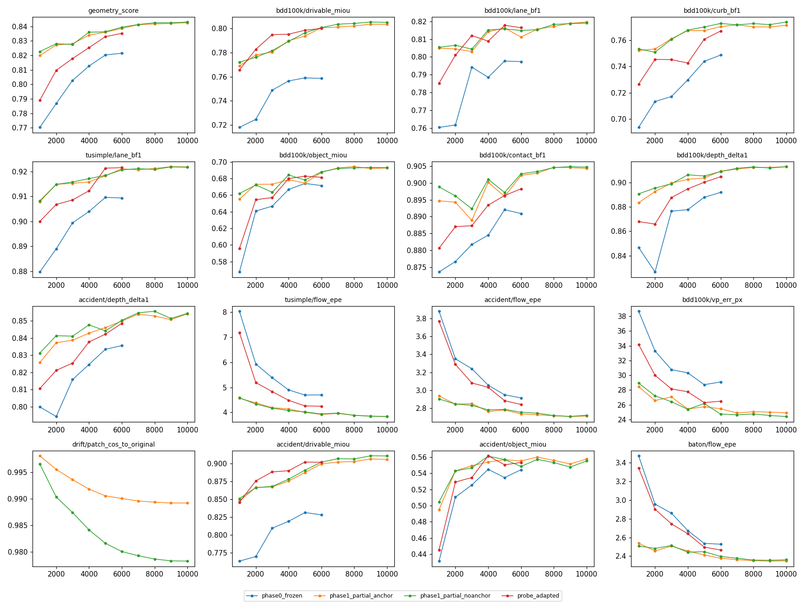
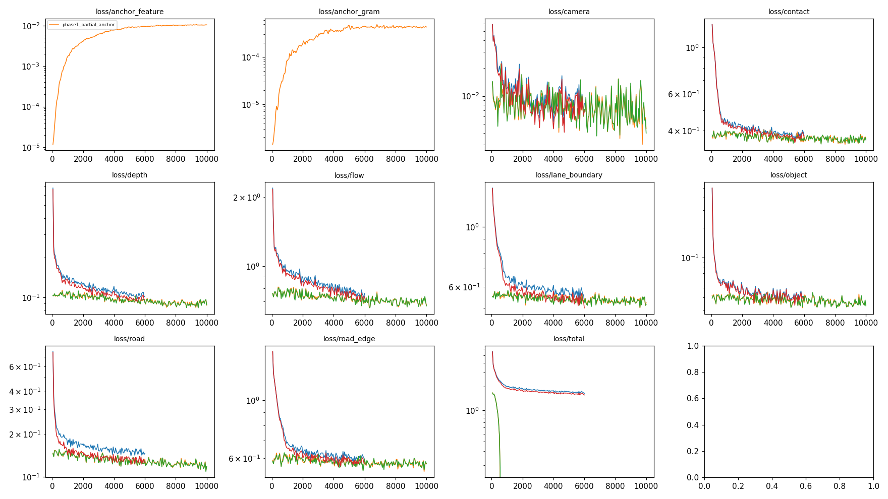
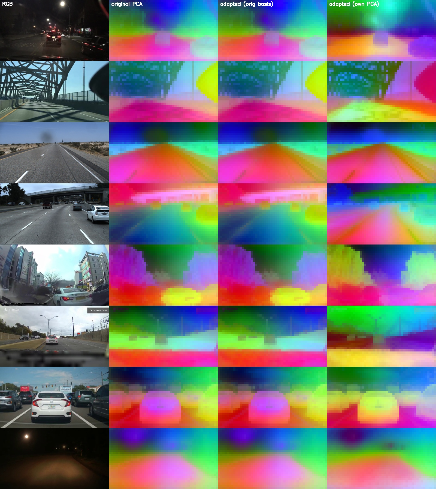

# Stage 2 geometry-aware DINOv3 ViT-S pretraining — report

*Run date: 2026-09-18, one L40S (shared with a Stage-3 job for part of the time).
Code: `stage2/geometry_pretrain/`. Every number below comes from files under
`/workspace/outputs/geometry_pretrain/` and the `eval_best.json` / `results_all.json` files cited.*

---

## Executive summary

| Question | Answer |
|---|---|
| **Did geometry pretraining work?** | **Yes, modestly.** It trained stably. Held-out geometry improved on every task and every source. The learned features stayed close to the original DINOv3. |
| **Did it improve held-out geometry?** | **Yes.** Fresh heads trained on the *frozen* adapted backbone (same protocol as the original-backbone probe) score 0.837 vs 0.824 on the selection score. BDD human-labelled drivable mIoU: 0.756 → 0.796. Lane boundary-F1: 0.803 → 0.823. Curb bF1: 0.748 → 0.764. TuSimple lane bF1: 0.909 → 0.922. Flow EPE: 4.58 → 4.14 px. So the gain lives in the backbone, not only in the heads. Jointly trained Phase-1 heads add a little more (drivable 0.801, flow 3.74 px). |
| **Did it preserve the original representation?** | **Yes.** With the anchor loss: mean patch cosine to the original 0.989, linear CKA 0.992, Gram correlation 0.995, CLS cosine 0.982. Without the anchor: 0.977 / 0.985 / 0.992 / 0.964. PCA feature maps are visually unchanged. |
| **Did it improve downstream Stage-2 performance?** | **Slightly, and only clearly for the no-anchor variant.** Identical small temporal probe, 5-fold video-level CV × 3 seeds, competition-style score. Original 0.565. Adapted + anchor 0.572 (paired Δ +0.006, t≈1.1, not significant). Adapted without anchor **0.583 (Δ +0.018, t≈2.3, 4/5 folds better)**. On the clean fixed split (validation videos never seen in pretraining): 0.530 → 0.556 (anchor) and **0.585** (no anchor). The gain comes from collision timing (+2.5 to +4.5 pts) and evasion-space F1 (+5 pts). Entry timing and entry side do not improve; they drop slightly, within noise. |
| **Which geometry tasks helped most?** | **Temporal correspondence (flow) is the task that matters for Stage 2.** Static-only adaptation scores −0.004 vs the original (entry timing −3.7 pts). Adding flow gives +0.012 over static-only (t≈1.9). On held-out geometry, the largest backbone gains: drivable/ego-lane segmentation (+4 mIoU pts on BDD human labels, +7–8 pts vs teacher on accident footage), flow/correspondence (−10% EPE), vanishing point (−9%). Objects/contact/depth gained less (+1–2 pts). Single-task removal at 4k steps changed other tasks by ≤0.005 (no measurable cross-task transfer). |
| **Which dataset sources helped most?** | Each source mainly helps its own domain. BDD100K carries most road/object quality. TuSimple lifts TuSimple lanes/VP. **Local accident + BATON footage is the only source that improves accident-domain objects (+3 mIoU) and dashcam flow (EPE 3.2 → 2.6 px on accident, 3.9 → 2.5 on BATON)** ([Dataset contribution](#dataset-contribution)). |
| **Is the checkpoint worth using for Stage 2?** | **Yes, as a drop-in replacement to try, using the no-anchor Phase-1 backbone.** It improves the controlled Stage-2 probe on both protocols and keeps CKA 0.985 with the original. Expect a small gain (≈+0.02 score in the probe), not a step change. Confirm inside the real Stage-2 model before committing. |

Recommended checkpoint:
`/workspace/outputs/geometry_pretrain/runs/phase1_partial_noanchor/backbone_best.pth`.
It is in the official DINOv3 `dinov3_vits16` state-dict format, so `load_state_dict(strict=True)` works.
The conservative alternative, with the best representation preservation, is
`runs/phase1_partial_anchor/backbone_best.pth`.

---

## 1. Data

### 1.1 Sources, subsets and footprint

| Source | What was downloaded / used | Split unit | Train | Held-out val | Disk |
|---|---|---|---|---|---|
| **BDD100K 100K images** | Official mirror `dl.yf.io/bdd100k`: `bdd100k_images_100k.zip` (5.7 GB, deleted after preprocessing), `bdd100k_labels.zip` (per-image JSON: lane polylines incl. road curb, drivable/alternative areas, 2-D boxes; 181 MB), `bdd100k_drivable_maps.zip` (451 MB). No video. | official train/val (each image = a distinct video) | 70,000 images | 10,000 images (3,000 used for final eval, 1,500 for model selection) | 4.9 GB images @448×800 + 0.6 GB zips |
| **TuSimple** | Full dataset only exists as a 23 GB Kaggle zip. I read its central directory over HTTP and fetched **only frames 12, 17, 19, 20** of every clip (`scripts/remote_zip.py`), 3.0 GB. | clip | 3,626 clips (frame 20 labelled) | 600 official *test* clips with `test_label.json` | 2.9 GB raw + 0.4 GB processed |
| **Local accident footage** (CCD / Nexar / AI-Hub) | Already on disk (Stage-2 decoded frames). **Only frames were used, never the 4 Stage-2 labels.** | video | 201 Stage-2 *train* videos → 3,783 anchor frames | 50 Stage-2 *val* videos → 948 frames | 0.5 GB |
| **BATON dashcam** (Stage-3 data, 41 comma.ai routes, 20 fps) | Already on disk. | route (hash split) | 31 routes → 4,402 frames | 10 routes → 1,301 frames | 0.2 GB |
| KITTI | **Not downloaded** (see recommendation). | – | – | – | 0 |

Frame sampling (`prepare/videos.py`) is FPS-aware: static anchors at 2 Hz (accident, capped at 30 per video) or 0.25 Hz (BATON, capped at 150 per route). Each anchor gets temporal partners at Δ ≈ 1 frame, ≈150 ms and ≈400 ms, converted per video from its native FPS (10 / 15 / 30 / 20 fps). The partners are, per source: TuSimple 19→20, 17→20, 12→20; Nexar 1/4/12 frames; AI-Hub 1/2/6; CCD 1/2/4.

Temporal pairs: TuSimple 10,878 train / 1,800 val. Accident 11,349 / 2,844. BATON 13,206 / 3,903. Total 43,980 pairs.

All inputs use one model resolution, **448×800** (28×50 DINO patches of 16 px; 16:9 center crop for non-16:9 sources). Dense targets are at stride 4 (112×200).
Manifests: `/workspace/cache/geometry_pretrain/manifests/{source}_{split}[_pairs].jsonl`.

### 1.2 Label provenance (human vs pseudo vs derived)

| Target | BDD100K | TuSimple | Accident / BATON |
|---|---|---|---|
| Drivable 3-class (bg / ego-direct / alternative) | **human** (drivable maps) | **derived** ego lane only (from human lanes; other pixels ignored) | **pseudo** (road teacher, conf ≥ 0.7, else ignored) |
| Lane markings | **human** (parallel lane polylines; crosswalks and stop lines ignored) | **human** | **pseudo** |
| Road curb / edge | **human** (`lane/road curb`) | ignored | **pseudo** |
| Objects (6-class: bg, car, truck, bus, two-wheeler, pedestrian) | **pseudo masks from human boxes** (SAM 2.1 box prompts) | pseudo (RF-DETR boxes → SAM) | pseudo (RF-DETR boxes → SAM) |
| Vehicle–road contact band | **derived** from accepted masks + human drivable map | derived | derived |
| Relative depth | pseudo (DA-V2) | pseudo | pseudo |
| Vanishing point / horizon | **derived** from human lane lines (7,246 BDD imgs) | derived (3,576 train clips) | none |
| Optical flow | – | pseudo (SEA-RAFT) | pseudo (SEA-RAFT) |

### 1.3 Pseudo-label acceptance

From `/workspace/cache/geometry_pretrain/cache_manifest.json` and the contact stats:

| | BDD100K | TuSimple | Accident | BATON |
|---|---|---|---|---|
| SAM instance masks accepted (geometric consistency with the prompt box; rejects become ignore regions) | 84.6% (729,651 / 862,143 train; tiny human boxes < 6 px are rejected by design) | 97.8% | 95.8% (17,427 / 18,183 train) | 98.6% (12,155 / 12,324) |
| Vehicle contact targets accepted | 232,975 of 879,040 vehicle instances (26%). Rejected: too small 25%, off-road/occluded below 25%, mask rejected 14%, truncated 9% | 19,952 / 32,477 | 9,374 / 21,364 | 6,773 / 15,399 |
| Flow pairs accepted (fw/bw-consistent fraction ≥ 0.3) | – | 99.2% (10,792 / 10,878) | 94.0% (10,667 / 11,349) | 90.2% (11,914 / 13,206) |
| TuSimple ego-lane derivable | – | 3,545 / 3,626 train; 578 / 600 val | – | – |

Per-pixel confidences are also used as loss weights: drivable softmax confidence, depth flip-consistency, SEA-RAFT uncertainty × fw/bw consistency.

---

## 2. Teachers

All teachers are frozen and run offline (cached, resumable).

| Task | Model / checkpoint | Confidence strategy | Qualitative assessment |
|---|---|---|---|
| Instance masks | **SAM 2.1 Hiera-Small** (`facebook/sam2.1-hiera-small`), box-prompted | Accept only if SAM IoU score ≥ 0.70 (human boxes) / 0.80 (detector boxes), mask tight-box IoU with the prompt box ≥ 0.7, and fill ≥ 25%. Otherwise the box region is *ignored*. | Very clean on cars/buses; weaker on thin two-wheelers and tiny far objects (those are ignored).  |
| Boxes (non-BDD) | **RF-DETR Small**, COCO (project checkpoint, sha256 d81979a9…), score ≥ 0.5, COCO→compact taxonomy | score threshold | Reliable for vehicles; misses heavily blurred crash frames. |
| Depth | **Depth Anything V2 Small** (local, Apache-2.0), relative inverse depth, 518×924 | Flip test-time augmentation: affine-align both passes, confidence = exp(−rel. disagreement/0.25), pixels < 0.3 ignored | Good relative ordering; object boundaries and thin poles are unstable (low confidence). DA-V2-S rather than B/L: already local and Apache-licensed. |
| Optical flow | **SEA-RAFT-S** (spring-S config, project checkpoint), run at 288×512 and stored at stride 4 (fp16) | Mixture-Laplace uncertainty × UnFlow forward/backward consistency × in-view test | Good on vehicles and ego-motion. Near-camera road leaving the frame is masked by the in-view test, as intended.  |
| Road / lane / curb (accident + BATON only) | **DINOv3 ViT-B/16** (official local checkpoint), last 4 blocks + head trained 7k steps on **BDD human labels only** (`configs/road_teacher_vitb.yaml`). BDD val: drivable mIoU 0.839, ego-lane IoU 0.841, lane bF1 0.881, curb bF1 0.820. | Flip-TTA; drivable softmax conf < 0.7 ignored, lane/curb probability in (0.3, 0.7) ignored | Conservative: night, rain and camera-pointing-at-sky frames are mostly ignored.  |
| Camera (VP) | No learned teacher. Derived from human lane lines (median of consistent pairwise intersections). | Kept only if ≥ 50% of intersections lie within 2.5% of the image width of the median | Precise where available (only ~10% of BDD images). |

Real human annotations always override teachers: BDD road targets are never pseudo-labelled, and TuSimple lanes are human.

Contact targets: 

---

## 3. Architecture

- **Backbone:** DINOv3 **ViT-S/16** LVD-1689M, 21.6M params, 12 blocks, 4 register tokens, RoPE.
  - Meta's signed download URL had expired, and the `facebook/` HF repo is gated. I used timm's re-hosted copy (`timm/vit_small_patch16_dinov3.lvd1689m`) and converted it to the official layout (`scripts/convert_timm_dinov3.py`).
  - The official checkpoints store all-zero qkv biases (verified on the local ViT-B), so the conversion is exact. Outputs are **bit-identical** to timm's reference implementation (max |Δ| = 0.0).
  - RoPE train-time coordinate augmentation is disabled permanently, so train and eval geometry match.
- **Input:** 448×800. **Features:** final-norm patch tokens (exactly Stage 2's `x_norm_patchtokens`). Multi-layer fusion is configurable (`model.out_blocks`) but unused.
- **Heads** (2.14M params total, all tiny):
  - Dense heads (road 5-ch, depth 1, objects 6, contact 1): 1×1 reduce to 128, then conv at 1/16, then ×2 upsample + conv at 1/8, then ×2 upsample + conv at 1/4.
  - Camera head: attention-pooled VP regressor.
  - **Flow head:** projection to 128-d, **global soft-argmax matching over all 1,400×1,400 patch pairs** of frames t and t+Δ, plus a small refiner, output at stride 4. The correspondence must therefore come from the backbone features themselves.
- **Trainable blocks:** Phase 0: 0/12. Phase 1: **last 4/12 blocks + final norm**, i.e. 7.10M backbone params trainable.
- **Anchor:** a frozen copy of the original last 4 blocks and norm, fed with the shared frozen trunk (`OriginalTail`). This is exactly the original DINO output at ~1/3 of the compute (unit-tested).

---

## 4. Losses

Each dense loss is `Σ w·ℓ / Σ w`, where `w` = valid mask × pseudo-label confidence × source weight. Pseudo road and pseudo objects are down-weighted ×0.7.

```
L = Σ_i  λ_i · exp(−s_i) · L_i + s_i          (uncertainty weighting, s_i ∈ [−2, 3])
      + λ_feat · (1 − cos(F_new, F_orig))      (anchor, not uncertainty-weighted)
      + λ_gram · ‖G_new − G_orig‖²              (G = normalized patch Gram matrix)

L_road     = CE(drivable 3-cls) with ×3 weight on class boundaries
L_lane     = BCE(pos_w 4) + soft Dice              (lane markings)
L_edge     = BCE(pos_w 4) + soft Dice              (curb)
L_depth    = scale-and-shift-invariant L1 on median/MAD-normalized disparity + 0.5 · gradient matching
L_object   = CE(6 classes, weights [0.5, 1, 1, 1, 1.5, 1.5])
L_contact  = BCE(pos_w 5) + soft Dice
L_camera   = SmoothL1(VP normalized, β = 0.02)
L_flow     = Σ w (|Δu| + |Δv| + 0.01)^0.4          (robust EPE, stride-4 px)
```

Manual weights λ: road 1, lane 1, edge 0.5, depth 0.5, object 1, contact 0.5, camera 1, flow 0.5. Anchor: λ_feat = λ_gram = 1 (anchor run) or 0 (no-anchor run).

At the end of Phase 1 the learned uncertainty multipliers λ·e^{−s} were: road 7.39, object 7.39, camera 7.39, depth 3.70, contact 2.75, lane 1.89, curb 1.75, flow 1.42. Road, object and camera **hit the clamp** (s = −2). One consequence: the anchor's *relative* weight fell by ~2–7× during training. It still held patch cosine at 0.989, but a future run should use a looser clamp or manual weights.

---

## 5. Training

| | Phase 0 (frozen probe) | Phase 1 + anchor | Phase 1 no anchor | Probe on frozen adapted |
|---|---|---|---|---|
| GPU | L40S 46 GB (shared) | same | same | same |
| Steps | 6,000 | 10,000 | 10,000 | 6,000 |
| Batch per step | 12 static images + 4 pairs (8 images) | same | same | same |
| Effective batch | 20 images (no accumulation) | same | same | same |
| LR heads / backbone | 5e-4 / – | 1e-4 / 5e-6 | 1e-4 / 5e-6 | 5e-4 / – |
| Optimizer / schedule | AdamW (wd 1e-4 heads, 0.05 backbone), 300–500 warmup, cosine to 5% | ← | ← | ← |
| Init | fresh heads | Phase 0 heads (LP-FT) | Phase 0 heads | fresh heads |
| Precision | bf16 autocast | ← | ← | ← |
| Wall time | 24.7 min | 90 min | 88 min | 72 min (contended) |
| Samples seen | 120k images | 200k images | 200k images | 120k images |
| Peak VRAM | 2.2 GB | 4.5 GB | 4.3 GB | 2.2 GB |
| Best step | 6000 (last) | 10000 (last) | 10000 (last) | 6000 (last) |

**Convergence:** not reached. Every run's best validation score is at its last step, and the curves were still rising slowly. The prompt's budget and a shared GPU limited run length.

Road teacher: 7,000 steps, 84k images, 73 min.

**Source distribution actually sampled in Phase 1:**
- Counting samples (a pair = 1 sample): BDD 52.5%, TuSimple 18.9%, accident 20.4%, BATON 8.2%. This is within the prompt's target ranges.
- Counting images: BDD 42%, TuSimple 24%, accident 24%, BATON 10%.




---

## 6. Held-out geometry results

- BDD val: 3,000 random images. TuSimple: 600 held-out test clips. Accident: the 50 Stage-2 val videos. BATON: 10 held-out routes.
- Flow: 1,800 / 1,500 / 1,500 held-out pairs.
- "vs teacher" rows measure agreement with pseudo labels; only the BDD/TuSimple human rows are ground truth.
- *TuSimple ego-lane recall is degenerate (only ego-lane pixels are labelled) and is not interpreted.*

| Metric | Frozen original + heads (Phase 0) | **Frozen ADAPTED + fresh heads** | Phase 1 joint (+anchor) | Phase 1 joint (no anchor) |
|---|---|---|---|---|
| BDD drivable mIoU (3-cls, human) ↑ | 0.756 | 0.796 | 0.801 | **0.803** |
| BDD ego/direct-lane IoU (human) ↑ | 0.761 | 0.797 | 0.801 | **0.802** |
| BDD lane boundary-F1 ±4 px (human) ↑ | 0.803 | 0.823 | **0.826** | 0.826 |
| BDD curb boundary-F1 (human) ↑ | 0.748 | 0.764 | 0.770 | **0.772** |
| TuSimple lane boundary-F1 (human) ↑ | 0.909 | 0.922 | **0.922** | 0.922 |
| BDD object mIoU (SAM @ human boxes) ↑ | 0.676 | 0.684 | **0.699** | 0.699 |
| BDD vehicle IoU ↑ | 0.867 | 0.870 | **0.875** | 0.875 |
| BDD contact boundary-F1 (derived) ↑ | 0.893 | 0.900 | **0.905** | 0.905 |
| BDD contact row error, px @448 ↓ | 1.97 | 1.91 | 1.85 | **1.84** |
| BDD depth δ<1.25 vs teacher ↑ | 0.893 | 0.905 | **0.913** | 0.913 |
| BDD depth AbsRel vs teacher ↓ | 0.099 | 0.092 | **0.086** | 0.086 |
| BDD depth ordinal accuracy ↑ | 0.979 | 0.981 | **0.983** | 0.983 |
| BDD VP error, px @448×800 (derived) ↓ | 27.8 | 25.4 | 23.7 | **23.3** |
| BDD horizon error, px ↓ | 9.29 | 9.29 | 9.05 | **8.93** |
| TuSimple VP error, px ↓ | 8.97 | 7.98 | 7.70 | **7.60** |
| Accident drivable mIoU vs teacher ↑ | 0.828 | 0.902 | 0.906 | **0.911** |
| Accident lane bF1 vs teacher ↑ | 0.865 | 0.889 | 0.897 | **0.898** |
| Accident object mIoU vs teacher ↑ | 0.544 | 0.553 | **0.558** | 0.555 |
| Accident contact bF1 ↑ | 0.856 | 0.860 | 0.864 | **0.865** |
| Accident depth δ1 vs teacher ↑ | 0.836 | 0.848 | **0.854** | 0.854 |
| BATON drivable mIoU vs teacher ↑ | 0.922 | 0.960 | 0.966 | **0.967** |
| TuSimple flow EPE, px @448 ↓ | 4.58 | 4.14 | 3.74 | **3.74** |
| TuSimple flow EPE, Δ=400 ms ↓ | 6.39 | 6.26 | **5.83** | 5.86 |
| Accident flow EPE ↓ | 2.67 | 2.59 | **2.49** | 2.49 |
| BATON flow EPE ↓ | 2.59 | 2.50 | 2.37 | **2.37** |
| **Geometry selection score** ↑ | 0.824 | 0.837 | 0.844 | **0.845** |

The second column is the key controlled comparison. It uses identical fresh heads and the identical 6k-step protocol, with only the frozen backbone changed; it recovers 65–100% of the Phase-1 gain on every road metric. Object, contact, depth and flow gains are partly head-side (the jointly trained Phase-1 heads are better than fresh heads on the frozen adapted backbone).

Qualitative predictions: target row, then Phase 0, then Phase 1+anchor.
[BDD](stage2_geometry_assets/pred_bdd100k.jpg) · [TuSimple](stage2_geometry_assets/pred_tusimple.jpg) · [accident](stage2_geometry_assets/pred_accident.jpg) · [BATON](stage2_geometry_assets/pred_baton.jpg) · flow: [TuSimple](stage2_geometry_assets/flow_tusimple.jpg) · [accident](stage2_geometry_assets/flow_accident.jpg) · [BATON](stage2_geometry_assets/flow_baton.jpg)

---

## 7. Representation drift

600 held-out images (150 per source), `evaluate.py drift`.

| | + anchor | no anchor |
|---|---|---|
| Mean patch cosine (adapted vs original) | **0.989** | 0.977 |
| Worst-image patch cosine | 0.962 | 0.905 |
| CLS cosine | 0.982 | 0.964 |
| Patch-token norm, original → adapted | 7.78 → 7.75 | 7.78 → 7.75 |
| Gram (patch-relation) mean abs diff | 0.017 | 0.033 |
| Gram correlation | 0.995 | 0.992 |
| Linear CKA (patch features) | **0.992** | 0.985 |
| Patch cosine by source (BDD / TuSimple / accident / BATON) | 0.990 / 0.987 / 0.991 / 0.987 | 0.980 / 0.976 / 0.979 / 0.973 |

PCA maps (columns: RGB, original PCA, adapted projected on the original's basis, adapted's own PCA): 

The adapted features are near-identical in the original basis. Their own leading components emphasize road-surface / lane-direction structure more.

---

## 8. Stage-2 probe: original vs geometry-adapted (controlled)

Protocol (`downstream_probe.py`):
- **Features:** frozen backbone, final-norm patch tokens on letterboxed 448×800 frames at ~10 fps (stride round(fps/10)), average-pooled to a 7×10 grid. Features are extracted once per backbone.
- **Probe:** the *same* tiny probe for every backbone (0.9M params): LayerNorm → 384→32 per token → frame MLP 2240→192 → 2 residual dilated temporal convs → per-frame entry/collision logits, and attention-pooled side/evasion heads.
- **Training:** 40 epochs, AdamW 1e-3, OneCycle, dropout 0.3.
- **Loss, decoding and metrics are Stage 2's own:** `joint_loss`, `constrained_decode`, `JointMetricAccumulator`. The score is additionally recomputed against native-frame labels ("native").
- Only the 251 Stage-2 videos are used here; their labels were never used before this point.
- **2Fixed split:** Stage-2 official train (201) / val (50). The 50 val videos were never seen, even unlabelled, by geometry pretraining, so this protocol is clean.
- **CV:** 5 folds, stratified by source × side × evasion, at video level, × 3 seeds. Caveat: frames of the 201 train videos were seen unlabelled (with pseudo-geometry) in pretraining, so in CV some validation-fold videos were seen by the adapted backbones. This is transductive exposure without event labels. It is a mild optimistic bias for B, which is why the fixed split is reported too.

**Fixed split** (mean ± std over 3 seeds):

| Backbone | Score | Entry acc@0.3 s | Collision acc@0.3 s | Side macro-F1 | Evasion macro-F1 |
|---|---|---|---|---|---|
| A. original frozen | 0.530 ± 0.014 | 0.240 ± 0.043 | 0.673 ± 0.025 | **0.859** ± 0.016 | 0.542 ± 0.099 |
| B. adapted (+anchor) | 0.556 ± 0.012 | 0.287 ± 0.034 | 0.680 ± 0.016 | 0.818 ± 0.046 | 0.631 ± 0.063 |
| B'. adapted (no anchor) | **0.585** ± 0.008 | **0.293** ± 0.025 | **0.733** ± 0.009 | 0.799 ± 0.061 | **0.706** ± 0.068 |

**5-fold CV × 3 seeds** (mean ± std over 15 runs):

| Backbone | Score | Entry acc@0.3 s | Collision acc@0.3 s | Side macro-F1 | Evasion macro-F1 |
|---|---|---|---|---|---|
| A. original frozen | 0.565 ± 0.032 | **0.381** ± 0.049 | 0.620 ± 0.065 | **0.858** ± 0.040 | 0.574 ± 0.082 |
| B. adapted (+anchor) | 0.572 ± 0.023 | 0.361 ± 0.036 | 0.645 ± 0.052 | 0.840 ± 0.039 | 0.622 ± 0.095 |
| B'. adapted (no anchor) | **0.583** ± 0.020 | 0.369 ± 0.038 | **0.665** ± 0.050 | 0.848 ± 0.037 | **0.626** ± 0.065 |

Paired differences vs A over the 15 fold×seed runs (± standard error):

| | Score | Entry | Collision | Side F1 | Evasion F1 | Per-fold score Δ |
|---|---|---|---|---|---|---|
| B − A | +0.006 ± 0.006 (t 1.1, 11/15 wins) | −0.020 ± 0.014 | **+0.025 ± 0.009** | −0.018 ± 0.011 | **+0.048 ± 0.012** | −0.008, +0.003, +0.029, −0.000, +0.007 |
| B' − A | **+0.018 ± 0.008** (t 2.3, 10/15 wins) | −0.012 ± 0.017 | **+0.045 ± 0.009** | −0.010 ± 0.013 | **+0.052 ± 0.016** | −0.008, +0.027, +0.050, +0.017, +0.004 |

Interpretation:
- The geometry features help **collision timing** and **evasion-space classification** (whether there is traversable space). Both follow plausibly from better drivable/ego-lane, contact and motion encoding.
- They do **not** help **entry timing** or **entry side** in this pooled-grid probe. The 7×10 pooling (≈80 px cells) is probably too coarse to resolve a vehicle's contact point crossing a lane line. A Stage-2 head reading full-resolution patch tokens or ROI features may benefit more; untested.
- Absolute probe scores (0.53–0.59) are far below the full Stage-2 model. The probe is intentionally weak so that it measures the backbone.
- Raw results: `/workspace/outputs/geometry_pretrain/stage2_probe/results_all.json`.

---

## Dataset contribution

All three runs: 4,000 steps, LP-FT from Phase 0, anchor on, identical optimizer. BDD-only has no temporal pairs (BDD has no pairs), so it is also static-only. Held-out eval is the same as §6.

| Metric | BDD only | BDD + TuSimple | + accident + BATON (full-4k) |
|---|---|---|---|
| BDD drivable mIoU (human) ↑ | **0.786** | 0.783 | 0.781 |
| BDD lane bF1 (human) ↑ | **0.819** | 0.816 | 0.817 |
| BDD curb bF1 (human) ↑ | 0.762 | **0.762** | 0.761 |
| **TuSimple lane bF1 (human)** ↑ | 0.898 | **0.919** | 0.915 |
| **TuSimple VP error px** ↓ | 10.3 | **7.6** | 8.1 |
| BDD object mIoU ↑ | **0.692** | 0.689 | 0.689 |
| **Accident object mIoU vs teacher** ↑ | 0.521 | 0.523 | **0.551** |
| Accident depth δ1 ↑ | 0.841 | 0.838 | **0.845** |
| TuSimple flow EPE px ↓ | – | **3.75** | 4.06 |
| **Accident flow EPE px** ↓ | – | 3.20 | **2.58** |
| **BATON flow EPE px** ↓ | – | 3.85 | **2.46** |

Findings:
- **Each source mainly helps its own domain.** TuSimple is responsible for TuSimple lanes (+2.1 bF1) and VP (−2.7 px).
- **Local accident/BATON footage gives the only gains on accident-domain objects (+3.0 mIoU) and dashcam flow (−0.6 / −1.4 px EPE).** Target-domain footage matters most for correspondence.
- The cost is ≈−0.005 on BDD human metrics, because BDD's sampling share drops from 100% to ~52%.
- Accident drivable/lane numbers are flat across the three runs. Those metrics are *agreement with a BDD-trained teacher*, so they cannot show a domain gain from accident data.
- The Stage-2 probe was not re-run per dataset variant (compute), so the downstream contribution per source is untested.

## Ablations

Completed (priority order from the brief):

1. Original frozen DINO + heads → Phase 0 (§6, column 1).
2. Geometry heads on a frozen backbone → Phase 0, plus the same-protocol probe on the adapted backbone (§6, column 2).
3. Partial adaptation **without** anchor → done (10k steps, §6/§7/§8).
4. Partial adaptation **with** anchor → done (10k steps).

Items 5–10 are reduced-budget runs (4,000 steps each, LP-FT from Phase-0 heads, anchor on) compared against a matching 4,000-step full run. Held-out geometry for all of them; the Stage-2 probe was re-run only for the most important one (static vs static + temporal).

| Held-out metric (4k steps) | full-4k | no flow (static only) | no depth | no road |
|---|---|---|---|---|
| BDD drivable mIoU (human) ↑ | 0.781 | **0.784** | 0.782 | – |
| BDD lane bF1 (human) ↑ | **0.817** | 0.816 | 0.816 | – |
| BDD curb bF1 (human) ↑ | **0.761** | 0.760 | 0.759 | – |
| TuSimple lane bF1 ↑ | 0.915 | **0.916** | 0.915 | – |
| BDD object mIoU ↑ | 0.689 | **0.690** | 0.688 | 0.689 |
| BDD contact bF1 ↑ | 0.900 | **0.900** | 0.900 | 0.899 |
| BDD depth δ1 ↑ | 0.903 | 0.904 | – | **0.904** |
| BDD VP error px ↓ | **25.7** | 25.7 | 26.0 | 25.9 |
| TuSimple flow EPE ↓ | 4.06 | – | 4.04 | **4.00** |
| Accident flow EPE ↓ | 2.58 | – | 2.57 | **2.55** |
| BATON flow EPE ↓ | 2.46 | – | 2.45 | **2.42** |

(The composite "geometry score" is not comparable across columns, because it averages over different sets of tasks.)

Findings:
- **Removing any single task changes the other tasks' held-out metrics by ≤ 0.005.** At this budget there is no measurable positive or negative transfer between tasks through the shared last-4-blocks.
- Removing the road task gives flow a slight edge (≈−1.5% EPE), consistent with mild gradient competition.
- **Static vs static + temporal on Stage 2:** see the table below. Temporal correspondence is the task that matters downstream.

**Static vs static + temporal, downstream** (identical Stage-2 probe, 5-fold × 3 seeds; 4k-step backbones):

| Backbone | CV score | Entry acc | Collision acc | Side F1 | Evasion F1 | Fixed-split score |
|---|---|---|---|---|---|---|
| original | 0.565 ± 0.032 | **0.381** | 0.620 | **0.858** | 0.574 | 0.530 |
| adapted, **static only** (no flow) | 0.562 ± 0.029 | 0.344 | 0.637 | 0.856 | 0.599 | 0.535 |
| adapted, static + **temporal** (full-4k) | **0.573** ± 0.020 | 0.365 | **0.652** | 0.834 | **0.615** | **0.549** |

Paired over 15 fold×seed runs:
- **static+temporal − static-only = +0.012 ± 0.006 (t 1.9, 11/15 wins)**, entry +2.1 pts, collision +1.5, evasion +1.5.
- **static-only − original = −0.004 ± 0.005**, with **entry timing −3.7 ± 1.1 pts (t −3.4)**.

**Geometry-only adaptation does not help Stage 2, and it hurts entry timing. The temporal-correspondence objective is what turns the adaptation into a (small) downstream gain.** This supports the brief's claim that correspondence is mandatory.

(Caveat: the two 4k-step backbones' features were extracted through a q95 JPEG cache of the letterboxed frames, while the original's were not. Their comparison with each other is exact; their comparison with the original carries that minor preprocessing difference.)
- Ablations 5–7 are therefore mostly *neutral* on held-out geometry, but ablation 8 (static vs temporal) is decisive downstream. Each task's own metric is what that task buys, and flow is the only task that makes the backbone correspondence-aware (EPE 4.58 → 3.74 px in the 10k run).
- Not run: PCGrad (only manual + uncertainty weighting are implemented) and Phase 2 broader unfreezing. The latter's precondition, clear underfitting of frozen features, was not established: frozen adapted features recover most of the joint-training gain.

11. KITTI: not run (not downloaded).

---

## Failure analysis

Examples are in the qualitative panels linked in §6 and §2.

- **Lane labels / teachers:** BDD lane annotations mark both edges of each painted line and skip many faint lines. The lane-IoU ceiling is therefore low (≈0.33), and I evaluate lanes with a ±4 px boundary-F1. The road teacher ignores most rain, night-glare and "camera sees sky" frames; that is correct, but it leaves little road supervision on exactly the hardest accident frames.
- **Depth:** DA-V2-S is unstable at object silhouettes and thin poles; the flip-consistency confidence down-weights these (see confidence maps). The pseudo-depth was not validated against metric ground truth (no KITTI); its metrics measure teacher agreement only.
- **Vehicle segmentation:** two-wheelers and pedestrians are the weakest classes (accident IoU 0.22 / 0.33). Motion-blurred crash frames produce missed RF-DETR detections, which leaves unlabelled vehicles counted as background.
- **Collision blur:** flow pairs spanning impact frames are the most often rejected by fw/bw consistency (94% acceptance on accident vs 99% on TuSimple). Validation flow EPE is highest for Δ = 400 ms (TuSimple 5.8 px).
- **Contact target:** only 26% of BDD vehicle instances yield a contact target. Most rejections are tiny or truncated vehicles, or vehicles parked off the annotated drivable area. The target therefore reflects on-road, fully visible vehicles, which is the Stage-2 case, but is sparse on curbside traffic.
- **Adapted-model regressions:** entry-side F1 drops about 1–2 pts and entry accuracy about 1–2 pts in the Stage-2 probe (within noise, but consistently not positive). On the rainy accident example, the adapted model hallucinates an "alternative" lane in the masked area where the teacher itself was uncertain.

---

## Storage analysis

| Item | Size |
|---|---|
| BDD100K (processed 448×800 images 4.9 GB + label zips 0.6 GB; 5.7 GB image zip deleted after use) | 5.5 GB |
| TuSimple (selected raw frames 2.9 GB + processed 0.4 GB) | 3.3 GB |
| Accident + BATON processed frames | 0.7 GB |
| Pseudo-label cache (all sources, compressed npz, fp16 flow, uint16 depth, uint8 masks) | 9.6 GB (BDD 4.5, TuSimple 1.2, accident 1.5, BATON 1.8) |
| Stage-2 probe features (5 backbones × 2.2 GB) | 11 GB |
| Checkpoints + logs + visualizations (`outputs/geometry_pretrain`) | ≈5.4 GB (road teacher 0.8 GB; 4 main runs + 6 ablations 4.6 GB) |
| New pretrained assets (DINOv3 ViT-S 165 MB, SAM 2.1-S 176 MB) | 0.3 GB |
| **Total new** | ≈ 40 GB |
| Peak temporary usage | ≈ +6 GB (BDD image zip during preparation) |
| Free space: start → now | 74 GB → 35G (the drop is shared with concurrent Stage-3 caches/runs; the letterboxed-frame cache (3.9 GB) and the road teacher's optimizer checkpoint (1 GB) were deleted at the end) |

The disk guard (`DiskGuard`, 12 GB margin) runs in every preparation, pseudo-labelling and checkpoint step. It never triggered.

---

## Recommendation

1. **Use `runs/phase1_partial_noanchor/backbone_best.pth` as the Stage-2 DINOv3 ViT-S encoder candidate.** It is drop-in (official `dinov3_vits16` keys, strict load). Validate it inside the real Stage-2 joint model with the existing training recipe before adopting it. Expected effect: small (+0.01 to +0.02 in the controlled probe), mostly on collision timing and evasion space.
   The anchored checkpoint (`runs/phase1_partial_anchor/backbone_best.pth`) is the safer choice if Stage-2 fine-tunes the backbone further (LoRA), because it starts closer to the original (CKA 0.992).
2. **Do not add KITTI yet.** The first experiment shows geometry adaptation gives measurable but modest downstream gains, and the binding limitations are elsewhere:
   - no run reached convergence; train 2–3× longer first;
   - entry timing/side are not helped; this likely needs finer spatial features or a contact-/lane-crossing-specific objective rather than more depth data;
   - uncertainty weights saturated.

   KITTI's main value (metric LiDAR depth) targets the depth task, which the ablations suggest is the least important one. Revisit KITTI only if a longer run shows depth quality is the bottleneck.
3. Next experiment:
   - keep the temporal-correspondence task (it is the one that transfers to Stage 2), and consider giving it more weight or more target-domain pairs;
   - 25–30k steps with the no-anchor or a weak-anchor (λ = 0.1) setting;
   - manual task weights, or a looser uncertainty clamp;
   - probe entry timing with a higher-resolution Stage-2 head.

---

## Reproduction

All commands run inside the `car-accident-dev` container from `/workspace/car-accident`; the full sequence is in `stage2/geometry_pretrain/scripts/run_all.sh`.

```bash
# dataset preparation
python -m stage2.geometry_pretrain.prepare.bdd && python -m stage2.geometry_pretrain.prepare.tusimple && python -m stage2.geometry_pretrain.prepare.videos
# pseudo labels
python -m stage2.geometry_pretrain.pseudo_labels.generate --stage static --splits val train
python -m stage2.geometry_pretrain.pseudo_labels.generate --stage flow   --splits val train
python -m stage2.geometry_pretrain.train --config stage2/geometry_pretrain/configs/road_teacher_vitb.yaml
python -m stage2.geometry_pretrain.pseudo_labels.generate --stage road --sources accident baton
python -m stage2.geometry_pretrain.pseudo_labels.generate --stage contact
python -m stage2.geometry_pretrain.pseudo_labels.generate --stage summary
# pretraining
python -m stage2.geometry_pretrain.train --config stage2/geometry_pretrain/configs/phase0_frozen.yaml
python -m stage2.geometry_pretrain.train --config stage2/geometry_pretrain/configs/phase1_partial_noanchor.yaml
python -m stage2.geometry_pretrain.train --config stage2/geometry_pretrain/configs/phase1_partial.yaml
# evaluation
python -m stage2.geometry_pretrain.evaluate geometry --run-dir /workspace/outputs/geometry_pretrain/runs/phase1_partial_noanchor
python -m stage2.geometry_pretrain.evaluate drift --adapted /workspace/outputs/geometry_pretrain/runs/phase1_partial_noanchor/backbone_best.pth --out /workspace/outputs/geometry_pretrain/drift/phase1_partial_noanchor
# Stage-2 original vs adapted
python -m stage2.geometry_pretrain.downstream_probe extract --name original --backbone /workspace/pretrained/dinov3_vits16/dinov3_vits16_pretrain_lvd1689m-timm-converted.pth
python -m stage2.geometry_pretrain.downstream_probe extract --name adapted_noanchor --backbone /workspace/outputs/geometry_pretrain/runs/phase1_partial_noanchor/backbone_best.pth
python -m stage2.geometry_pretrain.downstream_probe run --features original adapted_noanchor --folds 5 --seeds 0 1 2
# smoke tests (flow-under-augmentation, gradient isolation, sampler ratios, label ranges)
python -m pytest -q stage2/geometry_pretrain/tests/test_smoke.py
```

Engineering features:
- YAML configs with `base:` inheritance and `--set` overrides;
- step-based training, bf16, gradient accumulation, source-weighted sampling;
- exact resume (`last.pt`, verified), automatic best selection, backbone export;
- disk guard, GPU memory cap for shared GPUs;
- JSONL metrics + plots (TensorBoard is not installed; W&B not used to avoid online logging).
