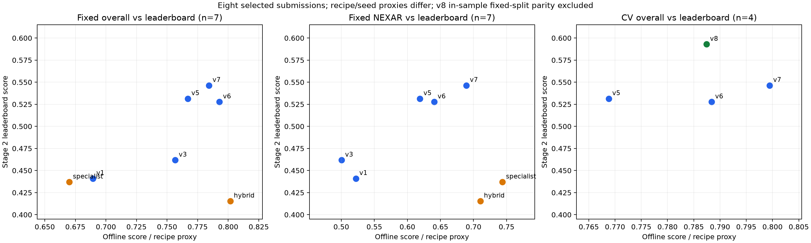

**Stage 2: experiment results, usable datasets, leaderboard transfer, and next steps**

Prepared 27 September 2026 from local reports, configurations, saved predictions, and evaluation code; public dataset documentation checked on the same date. Review began at approximately 10:23 UTC; the reproducible evidence snapshot was captured at 10:29 UTC. Runs may continue after this snapshot. The v6 leaderboard score **0.5277** was supplied directly by the user during this review; v7 **0.5464** is recorded as user-reported in `HANDOFF.md`. Subsequent user feedback on 27 September records **v8 Stage 2 leaderboard = 0.59293**; leaderboard tables and correlations below incorporate this update without refreshing the 10:29 experiment snapshot. The exact submitted archive/hash was not supplied with the score.

**Executive assessment**

The strongest established direction is **better motion evidence plus diverse training data**, with temporal-rate augmentation protecting against a demonstrated failure mode. The current recorded leaderboard best is **v8, 0.59293**, improving on v7 by **0.04653** (4.653 percentage points on the 0–1 score). This provides external support for the stride-augmented recipe and makes v8 the baseline for subsequent experiments. One aggregate leaderboard comparison does not establish that hidden footage has a particular frame rate. v6 is an important counterexample: its event-specific ensemble improved validation but scored slightly below v5 on the leaderboard.

The newest results support metadata-anchored MM-AU/CCD expansion as a promising next experiment, but its matched-seed gain is smaller and less certain than the overnight report suggests. Object tracks and wider ENTRY targets improve unseen-source evaluation while hurting ordinary CV; neither should be declared universally better. The main remaining problems are ENTRY definition/precision, weak evasion transfer, limited independent labeled data, and validation that does not reliably represent the hidden test.

The most important correction to the earlier brief is that **object-track features have now been tested**. A next object-centric experiment must add a genuinely different representation, such as actor appearance and identity-preserving temporal relations, rather than repeat the 44-dimensional box-statistics input.

**Scope and how to read the numbers**

I reviewed the September 20–27 experiment reports and their earlier backbone context, including spotting, FPS-blind heads, temporal pyramids, long-context experiments, NEXAR specialists, phase losses, auxiliary signals, generalization H1–H17, object tracking, and multi-source expansion. The accompanying [table archive](review_20260927/all_reported_experiment_tables.md) preserves all tables from 17 source reports, including superseded results. A [2,150-file atomic-run inventory](review_20260927/atomic_run_inventory.csv) lists discovered saved `metrics.json` files; these are not 2,150 independent hypotheses, and some are full-data/in-sample runs. Alternative metric schemas have blank columns rather than guessed scores.

The score used locally is `0.35 × ENTRY@0.3s + 0.35 × COLLISION@0.3s + 0.15 × side macro-F1 + 0.15 × evasion macro-F1`. Do not compare scores across these protocols as if they were one leaderboard:

- Early screening: 201 training / 50 validation clips, usually one seed.
- Later fixed split: 279 / 70; only 15 NEXAR validation clips.
- Recent CV: five folds over 349 clips, pooled out-of-fold per seed; distinguish a mean individual-model score from a probability-averaged seed ensemble.
- LOSO: leave one of four major sources out of head training, with fixed stopping or training-only selection. See the backbone exposure caveat below.
- Robustness: retained frames at native, half, or one-third rate, usually plain decoding; ordinary ensemble CV often adds motion fusion and native-frame snapping.

Reported historical values below are rounded. Fresh computations are stored in [latest_matched_results.json](review_20260927/latest_matched_results.json). Experimental IDs are local to their campaigns: the old E4 soft-target arm and the new E4 motion family are different models.

**1. Datasets already used and datasets worth using**

The current canonical manifest contains:

| Source | All labeled | Training | Fixed validation | Role / limitation |
|---|---:|---:|---:|---|
| AIHUB | 88 | 70 | 18 | Useful appearance diversity; local original metadata does not supply the needed event timings |
| CCD | 83 | 66 | 17 | Short 50-frame clips; informative collision metadata, weak support for long-context claims |
| NEXAR | 80 | 65 | 15 | Long clips and a useful hard subset; its small fixed slice is easy to overfit |
| MM-AU | 97 | 77 | 20 | Strong collision anchors, generally easier local clips; ENTRY semantics still require alignment |
| CausalCrash | 1 | 1 | 0 | Too little labeled coverage to estimate performance independently |
| **Total** | **349** | **279** | **70** | Source and clip length are strongly confounded |

Counts were read directly from `/workspace/data/stage2/manifests/{all,train,val}.jsonl`. On fixed validation, AIHUB is 150 frames, CCD 50, MM-AU roughly 50–355, and NEXAR 540–1248. More frames, longer duration, different FPS, source identity, and annotation conventions therefore cannot be separated by a simple per-length score plot.

The dataset choices below distinguish exact task labels from auxiliary supervision. “Can be used” means potentially useful subject to eligibility and access, not that every clip has valid Stage 2 labels.

| Dataset | Available evidence and practical use | Missing labels / risks | Priority |
|---|---|---|---|
| **Existing NEXAR expansion** | 670 additional clips already used by XN4; collision timestamp plus teacher-based ENTRY. Local collision alignment 80% within 0.3 s, about 88% after training-fold offset calibration | Public positives include near misses, not just actual crashes. Alert time is not Stage 2 ENTRY. Inspect actual-crash/ego-involvement eligibility before supervising physical collision | High for quality-controlled collision learning |
| **MM-AU** | Public metadata provides accident-window start and collision start; current expansion uses 258 additional clips. Strongest local metadata alignment: collision approximately 99%; metadata-constrained ENTRY pseudo-label approximately 84% on labeled diagnostics | Accident-window start is not exact ENTRY. Filter ego involvement, counterpart, visibility, and original-video duplicates. Local collection report already identified duplicate footage | Highest immediate expansion candidate |
| **CCD** | Per-frame accident labels and ego-involvement metadata; current expansion uses 400 clips. Local calibrated collision alignment approximately 89%, ENTRY pseudo-label approximately 72% | Original accident onset is not guaranteed physical first contact; frame indexing matters. Five-second/10 FPS clips do not cover long temporal contexts | High, paired with MM-AU and manual quality checks |
| **AIHUB** | 88 labeled clips plus 400 current teacher-only expansion candidates; useful domain diversity | No original collision timing in the inspected local labels. Adding teacher-only AIHUB did not improve the MM-AU+CCD ensemble result. Exact upstream release identification/access needs confirmation from provenance | Prioritize manual annotation over more blind self-training |
| **DoTA** | Official release includes temporal anomaly annotations and extracted box tracks/flow; useful new-source evaluation, actor localization, and weak temporal supervision | Anomaly onset/end are not automatically ENTRY/first contact. Requires task-specific filtering and annotation; original-video overlap with web accident corpora must be checked | Best new-source pilot; first use a modest audited subset |
| **DADA-2000** | Accident/attention data useful for actor saliency or ROI supervision | MM-AU explicitly includes a DADA component. Do not count DADA as independent additional data without deduplication; attention is not an evasion label | Targeted auxiliary supervision, lower priority for raw expansion |
| **DAD** | Additional dashcam accident-anticipation domain; useful for an external diagnostic set | Anticipation labels do not supply this task's four outputs; filter ego-involved vehicle collisions and annotate a subset | Medium, independent evaluation before large training |
| **CausalCrash** | Agent roles, temporal events, and causal/prevention descriptions can help review ambiguous examples. Earlier collection found 8 strict candidates out of 273 metadata rows | Small eligible yield; video URLs can fail; reasoning/counterfactual text is not verified binary evasion ground truth | Small audit set rather than a scaling strategy |
| **BDD100K** | Road-object, lane, and drivable-area supervision; already contributes to geometry pretraining | Ordinary-driving perception data, not exact crash ENTRY/COLLISION/evasion labels. CCD normal videos originate from BDD100K, so they are not independent sources | Reuse for an explicit free-space/actor module |
| **TuSimple** | Lane/corridor supervision; already used in geometry adaptation | Highway lane data with limited accident/task coverage; does not directly label ENTRY or evasion | Reuse existing assets; low priority for more collection |
| **BATON / existing ordinary driving footage** | Local geometry/correspondence pretraining already benefited from dashcam motion | No demonstrated exact Stage 2 supervision. Driving kinematics do not define another vehicle's ENTRY or available escape space | Auxiliary representation learning only |

Public support: [NEXAR release description](https://www.kaggle.com/competitions/nexar-collision-prediction/data), [MM-AU official repository](https://github.com/jeffreychou777/LOTVS-MM-AU), [CCD official repository](https://github.com/Cogito2012/CarCrashDataset), [DoTA official repository](https://github.com/MoonBlvd/Detection-of-Traffic-Anomaly), [DADA official repository](https://github.com/JWFangit/LOTVS-DADA), [DAD authors' project](https://aliensunmin.github.io/project/dashcam/), [CausalCrash dataset card](https://huggingface.co/datasets/meet2008/CausalCrash), [BDD100K paper](https://arxiv.org/abs/1805.04687), and [TuSimple official documentation](https://github.com/TuSimple/tusimple-benchmark/tree/master/doc/lane_detection). These sources establish dataset content; the numerical gains above come from your local experiments, not public benchmark claims.

Practical access: MM-AU's repository describes academic-use access, and CausalCrash is labeled CC BY-NC 4.0. Check the dataset's actual terms and competition external-data rules before adopting a new release; a repository's code license does not necessarily license its videos. This review downloaded no datasets.

The earlier collection report's 324-video deduplicated labeling queue is a historical collection result, not 324 guaranteed new clips today. Reconcile it against the current 349 labels before estimating remaining annotation work. The current pseudo-label files contain **1,058** rows: 258 MM-AU + 400 CCD + 400 AIHUB. The older consistency campaign cited 1,046; these are different snapshots, not an arithmetic correction to the older run.

**2. Results and assessment by method**

**Backbone, localization formulation, and early temporal heads**

| Method | Reported result / protocol | Strength | Weakness and interpretation |
|---|---|---|---|
| Geometry-adapted DINO, no anchor | Probe CV approximately 0.583 vs original 0.565; fixed 0.585 vs 0.530 | Small reproducible improvement concentrated in collision/evasion; retains most original representation | Does not solve ENTRY. Geometry-probe CV averages folds, unlike newer pooled CV; compare only within this experiment |
| Static-only adaptation | 0.562 vs original 0.565; static+temporal 0.573 at matched shorter pretraining | Flow/correspondence provides useful temporal signal | Better static segmentation alone is not a guarantee of better Stage 2 |
| Pooled scalar event head → dense event logits | Early v2 screen 0.3505 → 0.5550 | Large localization-formulation gain | One small fixed split; architecture and sampling subsequently evolved |
| Local temporal attention | Early v2 0.6683 vs dilated convolution 0.5440 and TemporalMaxer 0.5891 | Strong within-screen head | Cadence-sensitive: 0.4861 under 40% drop. Small differences between top variants are seed-uncertain |
| Explicit multi-rate feature differences | 0.6683 → 0.5839 | A plausible temporal cue | Failed in this implementation; later arms inherited this weak block, so chained ablations are confounded |
| Early consistency / event conditioning | 0.6391 / 0.6428; consistency best mean across tested sampling schemes 0.6088 | Improved stability relative to the inherited difference baseline | Neither establishes a win over a strong augmented modern baseline; attribute results mixed |
| Classification + displacement | Earlier spotting screen 0.611 vs classification-only 0.573 | Reduced normalized timing error | Lower error magnitude did not necessarily translate into enough ±0.3 s hits |
| ASFormer-lite | 0.634 on original 50-val screen; later 0.689 on 70-val; recorded LB 0.441 | Useful baseline and efficient temporal reasoning | These two validation scores are different datasets, not a training improvement |

Source reports: [backbone study](../reports/stage2_geometry_dino_pretraining.md), [v2 heads](reports/stage2_dinov3_experiments_report.md), [spotting](reports/stage2_geometry_dino_spotting_experiments.md).

**Sampling, temporal pyramids, and long-context methods**

| Method | Result | Strength | Limitation |
|---|---|---|---|
| P1 fixed-128 pyramid | Fixed 0.674 vs ASFormer 0.689 | About 274k parameters vs 1.04M | Smaller alone is not better |
| P2 adaptive sampling | Fixed seed0 0.730; batch-1 re-eval 0.735; four-seed ensemble 0.757 | Efficient and strong overall; improves short/medium clips | Long-clip NEXAR did not improve: ensemble NEXAR approximately 0.500 |
| P3 count jitter / P4 consistency | Fixed 0.690 / 0.703 | Lower some normalized errors | Did not beat P2; not equivalent to later stride augmentation with recomputed motion |
| Tiled local windows / exact targets | Fixed approximately 0.648–0.685 vs 0.689 baseline | Some extra NEXAR ENTRY hits | Often sacrifices collision; more native frames are not sufficient |
| Max / SGP pooling | CV 0.689 / 0.699 vs C0 0.687 | Small pooled gains | NEXAR 0.497 vs 0.551; fixed-split improvement did not generalize across folds |
| Coarse SSM / coarse attention | CV 0.685 / 0.708; NEXAR 0.503 / 0.550 | Attention slightly improves aggregate | No meaningful NEXAR win; added parameters/latency |
| Crop augmentation / EMA / both | Two-seed CV ensembles approximately 0.714 vs control 0.702 | Useful regularization and variance reduction | Source effects mixed; no evidence long context alone caused failures |
| Top-K pair scorer | Fixed 0.676 or 0.691 vs generator 0.696 | Makes candidate-selection hypothesis testable | Memorization; limited pair-oracle recall; scalar-only scorer changed nothing |
| Native-frame refinement | Fixed 0.651, or 0.681 when length-gated, vs 0.696 | Tests a precision bottleneck directly | Failed; additional samples do not create a missing visual event cue |
| NEXAR temporal-prior specialist | Fixed NEXAR 0.7438, overall 0.6701; LB **0.4370** | Exploits source-specific temporal regularity | Harmful transfer and poor non-NEXAR performance |
| Length-gated specialist | Fixed overall 0.8017 / NEXAR 0.7104; LB **0.4154** | Preserves short-clip branch in the local proxy | Length is a poor substitute for source/event semantics; hidden-test failure |

The batch-1 correction matters: GroupNorm included padded positions, so evaluation depended on batch composition. The 0.752→0.757 P2 revision is an evaluation-protocol change, not a new model. Sources: [pyramids](../reports/stage2_temporal_pyramid_framecount_experiments.md), [iterative search](../reports/stage2_iterative_search.md), [long context](../reports/stage2_long_context_v2_report.md), [specialist](nexar65_experiments/REPORT.md), [hybrid](length_gated_experiments/REPORT.md).

**Phase, complementary signals, and expanded ensembles**

| Method | Result | Strength | Limitation |
|---|---|---|---|
| NT event targets | Early CV approximately 0.695 vs C0 0.687 | Simple direct localization baseline | Does not itself solve domain transfer |
| Phase auxiliary CAT / ORD / ORD+transition | Eight-seed CV approximately 0.706 / 0.705 / 0.706 vs 0.699 control | Small mostly-ENTRY benefit; semantic targets outperform shuffled ones | Approximately +0.005–0.007, CIs cross zero; below original success bar |
| Old PH recipe | Reproduced approximately 0.690; initial report had 0.709 | Diverse historical checkpoints can contribute to an ensemble | Recipe-level advantage did not reproduce; checkpoint selection and lucky seeds mattered |
| Structured phase / transition decoding | Typically −0.03 to −0.08 vs direct | Enforces a plausible temporal structure | Accumulated phase mistakes create wrong events; retain direct decoding |
| Risk progression | R3 approximately 0.695 vs 0.699 at eight seeds | Cheap auxiliary head | No confirmed standalone or ensemble gain |
| Boundary [h, delta-h] | Screening +0.013; E2 on motion baseline approximately 0.743 vs E4 0.740 | Transition supervision; ensemble complementarity | Larger screening gain does not simply add to motion's gain |
| Lane intrusion | Approximately +0.010 in three-seed screening | Some usable semantic signal after pseudo-label QA | CI crosses zero; not specifically an ENTRY improvement |
| Learned global + residual motion | M1 0.730 vs M0 0.707; NT E4 0.740 vs A0 0.699 | Strongest input gain; improves collision and long-clip reliability | ENTRY barely changes; evasion transfer remains weak |
| Residual cue only at decoding | v5 approximately 0.7658 vs 0.7688 | Cheap | Duplicates existing camera-shift fusion; learning the input matters |
| NEXAR metadata expansion XN4 | Approximately 0.743 / NEXAR 0.657; fewer long-clip collision failures | Adds external event evidence beyond teacher imitation | ENTRY slightly worse; near-miss/task eligibility and duplicates need audit |
| XN2 boundary+expansion / collision-only XN4e0 | Approximately 0.742 / 0.739 | Tests label/head interactions | No demonstrated better default ensemble |
| High-res tokens / heavier ENTRY loss / sharper targets | Approximately −0.026 / −0.008 / −0.015 | Clear negative controls | More capacity or sharper optimization is not solving semantic ambiguity |
| Attribute stacker / per-attribute selection | Side/evasion regress; selection approximately −0.003 | Can exploit complementary evidence in principle | Unstable selection and overfit on small labeled data |
| v5 motion-fused multi-family ensemble | CV 0.7688; LB 0.5314 | First large documented LB gain, +0.0696 vs v3 | Multiple bundled changes; cannot attribute LB gain to PH alone |
| v6 event-specific 18-head ensemble | Fixed 0.7928; CV proxy 0.7884; LB **0.5277** | High local accuracy and verified package parity | LB −0.0037 vs v5 despite better validation; more selection complexity did not establish transfer |
| v7 E4+E2+XN4, full-data refit | Best research CV 0.79945; LB **0.5464** | Earlier leaderboard baseline; simple equal-weight family composition | CV uses a different seed count from package; expansion/refit/motion changes confounded |

Sources: [phase confirmation](../reports/stage2_phase_supervision_study.md), [auxiliary screening](../reports/stage2_complementary_signals_interim.md), [goal campaign](../reports/stage2_goal_campaign.md), [v6 package parity](../submission_tools/v6_stage2/parity_results.json), and [handoff](../HANDOFF.md).

**Generalization experiments H1–H17**

These predominantly compare against E4 or E4+stride; numbers are from the living report unless marked freshly recomputed. They are not all matched to one common baseline.

| ID / method | Outcome | Assessment |
|---|---|---|
| H1 stride augmentation | Three-seed E4 ensemble native/half/third 0.768/0.753/0.701 vs 0.749/0.708/0.633 | Strong robustness win; source transfer mixed but good default |
| H2 clip normalization | LOSO mean roughly −0.005 to −0.060 depending on channels | Removes useful magnitude/appearance evidence; reject |
| H3 source-balanced sampling | LOSO mean +0.005, worst −0.020 | Does not resolve source shift; mean gain hides a harmed hard source |
| H4 independent optical-motion statistics | LOSO mean −0.002, worst −0.019 | Not the later detector/track experiment; no ENTRY evidence gain |
| H5 cross-rate consistency | Better invariance, native score approximately −0.017 vs stride alone | Accuracy/invariance trade-off; reject as default |
| H6 mask MMAU ENTRY labels | LOSO mean −0.014, worst −0.047 | Removing an easy/differently labeled source did not help |
| H7 pre-collision truncation | CV −0.002; LOSO mean +0.009, worst −0.009 | Weak trade-off; did not fix long-gap ENTRY |
| H8 causal ENTRY head | CV approximately −0.014 | Tested causal architecture failed; not proof all causal/object approaches fail |
| H9 unlabeled multi-source consistency | CV −0.009; LOSO mean approximately zero | Extra videos without reliable new event supervision did not help |
| H10 geometry input | LOSO mean +0.009, no meaningful evasion transfer | Global geometry insufficient in this form |
| H11 source class-balanced attributes | LOSO mean +0.010; CV −0.008 | Better side transfer at native-accuracy cost; evasion unresolved |
| H12 token drop/noise | LOSO mean +0.010, NEXAR −0.027 | Mixed regularizer; do not select on mean alone |
| H13 EMA | Stronger individual-source transfer; larger E4+E2 ensemble loses | Helpful members do not guarantee a helpful ensemble |
| H14 adaptive attribute thresholds | Evasion F1 approximately +0.01, total score about +0.0015 | Too small/inconsistent to address representation problem |
| H15 event-anchored attribute pooling | LOSO mean +0.003, worst −0.011; side drops | Event locations do not contain all useful attribute context |
| H16 temporal-rate TTA | E4 +0.006; E4+stride −0.002 | Little gain after augmentation, extra runtime |
| H17 wider ENTRY targets | Six-seed LOSO ensemble 0.7035→0.7177; three-seed native ensemble 0.7683→0.7488 | Generalization/precision trade-off, not an adopted default |

Later two-family six-seed robustness confirms the non-EMA preference: E4+E2 stride gives 0.7723/0.7481/0.7059 vs EMA 0.7631/0.7401/0.6964. These are **two-family proxies**, not the packaged three-family v8/v9. [Generalization report](../reports/stage2_generalization_research.md).

**3. Overnight experiments: independently corrected comparisons**

The goal-0.9 report describes E4_sa 0.739 as a three-seed control, but saved predictions show **0.738650 is the six-seed mean**. Seeds 0–2 alone score **0.742148**. The analysis helper bootstraps clips across every available seed of each arm rather than intersecting seed IDs. Thus some original candidate/control deltas include a seed-composition difference.

Below I intersect seed IDs explicitly and recompute a source-stratified paired clip bootstrap, 2,000 replicates. Intervals reflect clip variation conditional on these models, not selection over many experiments or uncertainty over unseen domains.

| Candidate | Completed candidate seeds in this comparison | Matched control | Candidate CV | Matched delta [95% CI] | Candidate seed-ensemble |
|---|---:|---|---:|---:|---:|
| **OT_sa: 44-d tracked-box features** | 3 | E4_sa 0.742148 | 0.734630 | **−0.007518 [−0.020288,+0.004304]** | 0.758796 vs control 0.768341 |
| **XU_mc: +258 MM-AU +400 CCD** | 3 | E4_sa 0.742148 | **0.751298** | **+0.009150 [−0.003911,+0.022048]** | **0.771973** |
| XU_mca: also +400 AIHUB | 3 | E4_sa 0.742148 | 0.749317 | +0.007168 [−0.006028,+0.019941] | 0.764001 |
| **E2_sa_xu: boundary family + MM-AU/CCD** | 3 | E2_sa 0.738368 | **0.750738** | **+0.012370 [−0.001021,+0.025541]** | **0.765135** vs control 0.746115 |
| XN4_sa_xu: NEXAR + MM-AU/CCD expansion | **1** | XN4_sa seed0 approximately 0.759344 | 0.749331 | −0.010012 [−0.029730,+0.011565] | One member only; preliminary |
| H17 sigma_ENTRY=2 | 3 | E4_sa 0.742148 | 0.729827 | −0.012321 [−0.023928,−0.000335] | Different representation of same native-CV trade-off |

XU_mc's main gain is COLLISION: **0.8281→0.8510**; ENTRY only **0.6046→0.6094**. E2_sa_xu raises COLLISION **0.8223→0.8491** but lowers ENTRY **0.6055→0.5960**. It is therefore premature to call metadata expansion an ENTRY solution. AIHUB self-training increases video count without improving the MM-AU/CCD ensemble score.

Object tracks remain interesting for transfer. On matched three-seed LOSO, the individual-model mean improves **0.6651→0.6893**, worst source **0.5581→0.5791**, and seed-ensemble mean/worst **0.6926/0.5818→0.7158/0.6216**. The campaign report's displayed baseline ensemble 0.703/0.606 came from six seeds, so that particular ensemble comparison was not matched.

Do not overinterpret the failed hand-rule diagnostic. `objtrack/diagnose.py` chooses the largest vehicle box near **GT COLLISION**. It is an oracle-assisted heuristic for selecting an opponent, not a verified ground-truth opponent track. A maximum rule hit rate around 0.38 cannot establish that no physical ENTRY cue exists. Conversely, boxes alone failing in-domain is useful evidence against repeating the same box-statistics representation.

Source: [overnight campaign](../reports/stage2_goal09_campaign.md), [fresh result JSON](review_20260927/latest_matched_results.json), and [reproduction script](review_20260927/build_evidence.py). XN4_sa_xu had only one complete five-fold seed in the captured analysis; later completions should be analyzed separately.

**4. Validation versus real leaderboard: what the data actually says**

| Submission | Fixed overall | Fixed NEXAR | CV overall | CV NEXAR | Stage 2 LB | Important comparability note |
|---|---:|---:|---:|---:|---:|---|
| v1 ASFormer | 0.6893 | 0.5220 | — | — | 0.4410 | Fixed head matches submitted head |
| v3 P2 refit | 0.7567 | 0.5004 | — | — | 0.4618 | Fixed result is 279-training-clip proxy; submitted refit uses 349 |
| NEXAR specialist | 0.6701 | 0.7438 | — | — | 0.4370 | Prior-heavy fixed-split-selected candidate |
| Length-gated hybrid | **0.8017** | 0.7104 | — | — | **0.4154** | Specialist on long clips, P2 on others |
| v5 motion ensemble | 0.7670 | 0.6190 | 0.7688 | 0.6702 | 0.5314 | Historical recorded recipe metrics |
| v6 event-specific ensemble | 0.792831 | 0.640387 | 0.7884 | 0.7103 | **0.5277** | Fixed package parity verified; CV event-selection proxy |
| v7 residual+expansion refit | 0.784312 | 0.689167 | **0.799453** | **0.720740** | **0.5464** | Offline family/seed proxy differs from 12-member full-data package |
| v8 stride-augmented refit | — | — | 0.787419 | 0.707134 | **0.59293** | Three-family, three-seed OOF proxy; package uses four seeds per family and full-data refitting |

Only Stage 2 scores are compared; changes in Stage 3 settings do not explain this table. v8 is user-reported; v9 remains unscored in the available record. v8 package parity evaluates a full-data refit on training clips: its 0.957835 overall / 0.953333 NEXAR scores are in-sample and excluded from held-out validation comparisons. Earlier prose calling v7 “not submitted yet” is superseded by the later HANDOFF score.

Using these eight recorded submissions, excluding missing held-out metrics from each calculation:

| Offline measure vs LB | n | Pearson r | Spearman rank correlation | Interpretation |
|---|---:|---:|---:|---|
| Fixed overall | 7 | **0.453** | **0.143** | Weak ranking agreement despite some positive broad trend |
| Fixed NEXAR | 7 | **0.011** | **−0.321** | The small source slice is not a useful rank predictor in this sample |
| Pooled CV overall | 4 | 0.244 | 0.000 | Too few points, with mismatched recipe/seed proxies, to validate predictive reliability |
| Pooled CV NEXAR | 4 | 0.282 | 0.000 | Equally underdetermined |
| Fixed overall excluding the two specialist submissions | 5 | 0.854 | 0.700 | Post-hoc sensitivity analysis only; exclusion removes key counterexamples |

These are descriptive correlations across selected, related submissions with mismatched proxies. They are not estimates of future predictive reliability. Fixed-overall Pearson varies from **0.307 to 0.889** when one submission is omitted, showing how unstable the summary is. There is not enough matched LOSO/robustness-plus-LB evidence to estimate those correlations at all. Do not fit a regression to forecast the next submission. The four-point CV correlations mix v7's larger research ensemble with v8's three-seed proxy; the matched v7→v8 comparison below is more informative. Fixed-split correlations remain unchanged because no comparable held-out v8 fixed-split result is recorded.

The informative paired changes are:

- **v3→v5:** recorded LB **+0.0696**; supports the broader motion/fusion/multi-family pipeline, but does not identify a single causal component.
- **v5→v6:** CV **+0.0196**, fixed **+0.0258**, yet LB **−0.0037**. This is counterevidence to “more offline score always transfers.” The LB difference is small and has no reported uncertainty.
- **v5→v7:** research CV **+0.0307**, fixed approximately **+0.0173**, LB **+0.0150**. Improvement transfers in direction, but full-data refitting, motion families, and expansion changed together.
- **v7→v8:** LB **+0.04653**. With matched three-family seeds 0–2, CV overall rises **0.783754→0.787419 (+0.003665)**, while NEXAR falls **0.717119→0.707134 (−0.009985)**. Plain-decoder native/half/third-rate scores change approximately **0.772/0.720/0.648→0.775/0.759/0.718**. Thus the external gain aligns more strongly with improved rate robustness than with the magnitude of native-CV gain. Both packages retain the three-family full-refit structure; stride training is the principal intended change, but checkpoint/stopping differences and the unconfirmed submitted archive limit strict causal attribution. This is one supportive comparison, not a robustness–LB correlation estimate.
- **v3→hybrid:** fixed proxy improves approximately **+0.0450**, LB falls **−0.0464**. Source/length-specific prior fitting is a poor direction on available evidence.

v8's three-seed CV-proxy-to-LB gap is approximately **0.19449**. v7's validation-to-LB gap remains approximately **0.238** using fixed validation or **0.253** using the best research CV proxy. Because the models/protocols differ, these are descriptive gaps, not a pure estimate of domain-shift cost. [Exact inputs and provenance](review_20260927/leaderboard_pairs.csv); [correlation calculations](review_20260927/leaderboard_correlations.json).

**5. Hypotheses about the hidden leaderboard dataset**

The scores constrain behavior more than they reveal dataset identity. In particular, they do not establish a country, camera model, exact FPS, accident taxonomy, or NEXAR fraction.

| Hypothesis | Evidence for it | Alternative explanation / limitation | Confidence and discriminating test |
|---|---|---|---|
| Hidden data differs materially from the fixed source mixture or labeling process | Large offline/LB gaps; prior specialist failure; substantial local LOSO gaps | Pipeline differences, annotation ambiguity, and repeated validation selection also contribute | Moderate confidence in a representativeness problem; test a newly labeled independent source with the packaged runtime |
| NEXAR midpoint/gap priors do not transfer well | Specialist and hybrid underperform despite high NEXAR validation | Cannot isolate prior from every model/refit difference | Moderate evidence against that prior strategy; test prior on/off with identical checkpoints locally across source-clean holdouts |
| Some hidden examples may be long or temporally difficult | Hybrid and NEXAR-specialist failures; motion-based methods improve | **v3 was a 349-clip refit, while hybrid's short branch uses a 279-clip P2 proxy.** Thus “only long clips changed versus scored v3” is not a clean causal comparison | Low-to-moderate; do not claim the hybrid result proves >500-frame clips. A true identical-short-branch paired comparison would be required |
| Hidden footage may have different cadence, event speed, or temporal scale | Stride augmentation improves local rate robustness and v8 improves real LB by 0.04653 with only +0.00367 matched native CV | Augmentation may regularize broadly; aggregate LB cannot distinguish FPS, motion speed, context, or annotation effects. Stage 3's 10 Hz rule cannot be transferred to Stage 2 | Stronger support for temporal robustness as useful; exact hidden cadence remains unconfirmed. Measure frozen-model errors by cadence, event speed, context, and visibility on an independent labeled set |
| ENTRY conventions may differ from the training mix | Opposite signed ENTRY biases on held-out AIHUB/NEXAR; widening targets helps LOSO | Different appearance, occlusion, or event composition can cause the same pattern | Moderate hypothesis, not proven; blinded multi-source reannotation under one operational definition |
| Hard collisions/weak impact visibility occur | Motion models transfer better; inspected side-swipes have ambiguous contact | Motion gains could arise from broad representation improvements | Plausible; annotate impact visibility and type, and test subgroup effects |
| Hidden data is simply low-resolution | Little degradation under tested 4× resolution reduction | That test does not cover compression, motion blur, night, or occlusion | Weak support for resolution alone; use a small targeted corruption/visibility suite |
| Hidden test is mostly NEXAR | NEXAR is locally difficult and some score levels are close to LB | Fixed NEXAR rank correlation is negative; source specialists fail; several distinct domains could produce the same aggregate score | Unsupported as a dataset identity claim |

A source-mixture estimate from these scores would be non-identifiable: there are too few matched models, unknown event/label shifts, and macro-F1 is nonlinear under dataset mixing. Do not present a fitted source percentage as a discovery.

**6. Cross-cutting weaknesses and reliability limitations**

**ENTRY remains the largest localization opportunity.** The best saved campaign has ENTRY 0.6877 versus COLLISION 0.8739. Matching those accuracies would add about 0.065 score, but that is headroom arithmetic, not a predicted achievable gain. Long-gap failure, near misses outside ±0.3 s, and inconsistent operational definitions all deserve measurement. Current evidence does not prove that the task is visually impossible or that only labels are responsible.

**Collision supervision is easier to scale than ENTRY/evasion supervision.** MM-AU/CCD timestamps add external information, whereas an AIHUB teacher mostly reproduces its own beliefs. This explains the observed pattern plausibly; it is not proof every teacher-only method must fail. Do not treat near misses as physical collisions or assign unverified evasion labels from prevention text.

**Expansion eligibility and duplicate control need an explicit audit.** `generalization/unl_expand.py` selects AIHUB/CCD clips from an `unusable_only.csv` pool, and lists MM-AU raw videos while excluding labeled IDs. “Unusable” may mean unannotated, wrong task, or bad footage; the script does not resolve that distinction. The earlier collection removed 39 visual duplicates from its labeling queue, but using a raw-video directory does not automatically inherit that queue's exclusions. This does not demonstrate leakage; it establishes a concrete check required before trusting expansion gains. Audit original URLs, parent videos, exact/perceptual duplicates, eligibility reasons, and frame mappings against every validation fold.

**LOSO is not necessarily a fully unseen-source pipeline.** The shared geometry backbone was adapted using original Stage 2 training footage from AIHUB/CCD/NEXAR, without the four Stage 2 target labels. Later LOSO reuses that backbone while holding a source out of temporal-head training. Consequently, held-out sources may already have influenced representation learning. Call this head-level source holdout unless provenance confirms otherwise. This is different from supervised target leakage, but it limits claims of fully unseen-domain generalization. Compare against original DINO or a backbone adapted only on external, source-clean data before making a stronger claim.

**Sampling diagnostics still contain a units bug.** The reviewed `robust_eval.py` keeps native-frame prediction errors but uses retained-frame counts for normalized error; stride increases therefore inflate catastrophic rates. The main time-tolerance score is unaffected. Fix denominator semantics and rerun diagnostics before interpreting those rates. Crop seeding still uses Python `hash`, so it is not process-stable unless hash seeding is fixed. GT-containing crops test event-preserving context changes, not arbitrary truncation.

**Small data plus repeated model selection causes optimistic local estimates.** Checkpoints are selected on validation folds; recipes, decoder weights, and family choices reuse the same clips. More seeds reduce training noise but do not add new examples. The old PH reversal, H17 shrinkage, and v6 LB result all demonstrate why a small selected gain is insufficient.

**FPS-blindness needs a precise definition.** Model inputs remain FPS-blind, but the current expansion label builders use FPS to convert external timestamps and define teacher windows. That differs from the earlier stricter “FPS only in evaluation” training-path claim. Record this distinction accurately; whether external timestamp conversion is allowed depends on the task's actual constraints.

**7. Experiments and methodologies most likely to help next**

The following order reflects the new results, including v8's leaderboard gain. Preserve stride augmentation and v8's equal-weight three-family recipe as the control; test additions against it rather than restarting native-CV-only selection. Add a controlled augmentation-strength study (current policy versus weaker/stronger stride mixtures with identical seeds and decoder) after evaluation fixes, using native accuracy, rate robustness, and source holdouts jointly. Do not infer that more aggressive stride must be better. It supersedes recommendations to start another identical box-statistics experiment. Suggested gates are engineering choices to declare before running, not guaranteed statistical thresholds.

| Priority | Experiment / methodology | Controlled comparison | Decision evidence |
|---|---|---|---|
| **P0** | Repair evaluation and provenance | Stable crop seeds; native-span normalization; intersect seed IDs in paired comparisons; verify label/feature lineage and expansion eligibility | Focused regression checks; official score unchanged by diagnostic fixes; no train/val original-video overlap |
| **P1** | Confirm metadata-supervised MM-AU+CCD expansion | E4_sa vs XU_mc and E2_sa vs E2_sa_xu, six matched seeds; keep data mix/decoder fixed | Repeatable collision/overall gain, preserved ENTRY, source-clean LOSO and stride robustness; intervals and negative results reported |
| **P1b** | Separate collision benefit from noisy ENTRY pseudo-labels | Extra COLLISION-only vs current COLLISION+ENTRY; source-specific quality masks estimated on training data only | Does removing pseudo-ENTRY recover the E2 ENTRY loss while retaining collision gains? |
| **P1c** | Check expansion combinations at fixed ensemble size | Replace a v8 family with its expansion counterpart; do not merely add members; finish XN4_sa_xu before conclusions | Matched seed/family counts; compare per-event errors and ensemble gains, not only standalone means |
| **P2** | Obtain clean information rather than more teacher copies | Blinded audit of 48–64 balanced clips; annotate a modest new-source set, preferably filtered DoTA or genuinely new local candidates | Shared ENTRY/evasion definitions, ambiguity intervals, reviewer agreement, locked holdout never used for selection |
| **P3** | Object appearance + track identity, not box statistics again | Existing OT_sa vs ROI appearance + identity-preserving temporal encoder, with equal-capacity global-feature control | ENTRY improvement on long-gap/occluded cases and LOSO, beyond extra parameters; detection coverage and ID-switch diagnostics |
| **P4** | Uncertain ENTRY training without broadening the main decoder | Sharp main head + broad auxiliary ENTRY head vs sharp auxiliary control; or independently annotated training intervals | Recover some LOSO benefit with native-score regression ≤0.005, rather than H17's larger native penalty |
| **P5** | Evasion-specific actor/free-space relation | Existing global geometry vs threatening-actor-relative free-space head; first keep other outputs fixed | Improved held-out evasion F1 and AUC across several sources; no GT event/actor selection at inference |
| **P6** | Representation-domain audit / small temporal adaptation | Original DINO vs current adapted backbone vs source-clean temporal adaptation; freeze head recipe | Distinguish pretraining exposure from true transfer; only attempt small adapters after a clear learning curve/data-quality result |

P1 is the cheapest well-supported direction: it already has positive results in two families. However, freshly matched 95% intervals still include zero, so confirmation is necessary. XU_mc's seed-ensemble gain is only about **0.0036** over E4_sa, despite its **0.0092** mean-member gain; do not promise that a stronger standalone family automatically lifts v8 by the same amount.

For P2, reserve a portion of new annotations as a genuinely locked evaluation set; do not turn every labeled clip immediately into training data. Sample difficult long-gap ENTRY, ambiguous side-swipe contact, occlusion, and diverse lighting, while retaining a random representative component. Keep original benchmark labels and proposed audit labels separate. Disagreement should be measured, not silently “corrected” to the model's preferred event.

For P3, verify which actor matters without using GT collision to choose it at inference. Include missing-detection masks, track identity continuity, ROI appearance, ego-lane-relative coordinates, and temporally consistent features under rate changes. Keep the first model small. A clip-by-clip evidence audit should precede a large feature extraction job.

For P4, a broad auxiliary head is a proposed new experiment, not a known remedy. If uncertain-label intervals are unavailable, do not invent source-specific timing corrections from held-out residuals. A stronger label definition is more useful than tuning offsets to the same 349 clips.

For any source-clean LOSO expansion, exclude the held-out source from both teacher training and extra videos. When NEXAR is held out, a NEXAR-expanded XN4 arm cannot remain literally identical to the submission recipe; clearly label the source-clean analogue. Keep architecture, sample counts, and decoder policy comparable where possible.

**Selection and reporting policy**

1. Screen three complete matched seeds; extend only finalists to six or eight. Use the same original-video groups and seeds in controls. Record incomplete runs rather than hiding them.
2. Keep a scorecard with pooled CV, four LOSO sources, worst source, native/half/third rate, all four task metrics, and short/long runtime. Do not optimize a single source slice.
3. For finalists, test the exact intended ensemble size and family composition with a runtime-parity check. Full-data refits must not be evaluated as held-out models on their training clips.
4. Bootstrap paired clips or parent-video groups, recompute macro-F1 inside each replicate, and disclose repeated-search bias. No confidence interval from the current clips can substitute for an independent dataset.
5. Use leaderboard feedback as an external check for a frozen, justified candidate, not as a target for many source-prior/offset probes. No new submission or training was performed for this report.
6. Retain v8 (**0.59293**) as the **recorded leaderboard baseline**, preserve v7 as the ablation reference, and keep v9 labeled unscored. Record the submitted archive/hash when available so the user-reported result can be bound to an exact artifact. v6 does not justify more event-specific family-selection search.

**Artifacts and reproducibility**

- [All documented experiment tables](review_20260927/all_reported_experiment_tables.md): historical details, including every table in the selected reports; later corrections take precedence.
- [Atomic run inventory](review_20260927/atomic_run_inventory.csv): file-level results, not pooled estimates.
- [Fresh matched-seed results](review_20260927/latest_matched_results.json): overnight arms, bootstrap intervals, and object-track LOSO.
- [Leaderboard pairs](review_20260927/leaderboard_pairs.csv) and [correlations](review_20260927/leaderboard_correlations.json): include the user's v6 and v8 scores; v8 in-sample parity is excluded.
- [Comparison chart](review_20260927/validation_vs_leaderboard.png), also available as [SVG](review_20260927/validation_vs_leaderboard.svg).
- [Evidence builder](review_20260927/build_evidence.py) and [chart script](review_20260927/plot_evidence.py). Run the evidence builder from the repository root with the existing Python environment; plotting additionally needs matplotlib. The chart uses the saved snapshot rather than rereading changing runs.
- Earlier [agent brief](STAGE2_NEXT_EXPERIMENTS_AGENT_BRIEF.md) remains useful for operational controls, but the new object-track, expansion, and v6/v7/v8 leaderboard evidence in this report supersedes its status assumptions.
