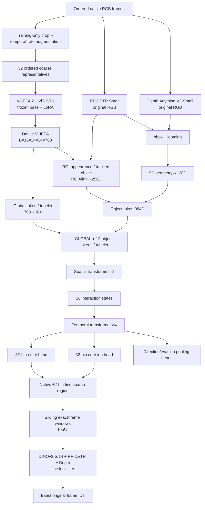

> **2026-09-09 configuration update:** The implementation now uses V-JEPA 2.1
> ViT-L/16 (1024D) and DINOv2 ViT-B/14 (768D), LoRA rank 16, and four fully
> unfrozen final transformer blocks alongside LoRA. Both stages use batch size 4
> with accumulation 2 and T_max=64 (32 coarse tubelets and 64 event bins). See [WORKSPACE.md](WORKSPACE.md) for current settings and
> feature projections. The original design below records the preceding baseline.

# Stage 2 Architecture — Final Codex Specification

> **Status: final fixed Stage-2 architecture.** This specification supersedes all earlier Stage-2 architecture drafts. Any conflicting older tensor shape, temporal length, localization head, detector choice, or fine-window rule must be ignored.
>
> The architecture intentionally excludes road segmentation / ego-corridor estimation, optical flow, explicit camera-motion compensation, trajectory-angle features, and other handcrafted geometry from the fixed model. The only explicit geometry retained is **bbox state/history + relative depth + looming/expansion**.

---

## 0. Locked architecture decisions

| Component | Final choice |
| --- | --- |
| Coarse visual backbone | V-JEPA 2.1 ViT-B/16, pretrained base frozen + trainable LoRA |
| Coarse RGB length | T = 32 ordered representative frames |
| Coarse RGB size | 384×384 letterbox, no crop |
| V-JEPA tubelet | 2 frames × 16 × 16 pixels |
| Dense V-JEPA output | `[B,16,24,24,768]` |
| Object detector | **RF-DETR Small**, COCO pretrained, frozen |
| Detector input | Original non-photometrically-augmented frame using RF-DETR's own preprocessing, nominal 512×512 model resolution |
| Detector classes retained | car, truck, bus, motorcycle |
| Object unit | Persistent track, never independent per-frame top-k detection |
| Maximum tracks | N = 12 per coarse clip / fine window |
| Relative depth | Depth Anything V2-Small, frozen |
| Explicit geometry | 9D = 5 bbox + 2 relative depth + 2 looming |
| Geometry MLP | 9→64→128 |
| Coarse ROI | ROIAlign 3×3×768 → mean pool → 768→256 |
| Coarse object token | 256D ROI appearance + 128D geometry = 384D |
| Coarse global token | V-JEPA spatial mean 768→384 |
| Coarse spatial transformer | 2 layers, d=384, 6 heads, pre-LN, MLP ratio 4, dropout 0.1 |
| Coarse temporal transformer | 4 layers, d=384, 6 heads, pre-LN, MLP ratio 4, dropout 0.1 |
| Coarse event outputs | 32-bin discrete entry distribution + 32-bin discrete collision distribution |
| Video outputs | LEFT/RIGHT + evasion-space 0/1 |
| Fine visual backbone | DINOv2-S/14, pretrained base frozen + trainable LoRA |
| Fine RGB size | 336×336 letterbox, no crop |
| Fine temporal unit | One exact native frame per valid temporal position |
| Fine maximum window | 64 consecutive native frames |
| Long fine region inference | Sliding 64-frame windows with stride 32 + forced final end-aligned window |
| Fine tracking | Rerun RF-DETR + tracking independently inside each fine window; no coarse-track ID reuse |
| Fine exact-frame model | DINO global/ROI + independent 9D geometry MLP + spatial transformer + temporal Conv1D + temporal transformer + boundary feature |
| Outputs | `collision_frame`, `entry_frame`, `evasion_space`, `entry_side` |

### 0.1 Required label conventions

- `entry_side`: class 0 = `LEFT`, class 1 = `RIGHT`.
- `evasion_space`: class 0 = no usable evasion/progression space at collision; class 1 = usable evasion/progression space exists at collision.
- Submission must contain integer `0/1` for `evasion_space` and string `LEFT/RIGHT` for `entry_side`.

### 0.2 Required frame-ID convention

Never assume frame filenames are contiguous or that Python directory order is correct.

For every sample:

1. parse the integer frame ID from each filename, e.g. `frame_001249.jpg -> 1249`;
2. sort frames by this numeric frame ID;
3. maintain the exact array

```text
frame_ids = [id_0, id_1, ..., id_{L-1}]
```

throughout preprocessing;
4. entry/collision predictions must return an element of this original `frame_ids` array.

Never submit a newly generated sequential index if it differs from the filename's original frame number.

---

# 1. Core modeling principle

Stage 2 must infer accident-event structure from an ordered dashcam sequence **without assuming known FPS or physical duration at inference**.

The model uses:

1. **Global V-JEPA scene semantics** — overall scene/event context.
2. **Object-centric V-JEPA ROI semantics** — local appearance/context around selected traffic participants.
3. **Compact explicit geometry** — object position/size, relative depth, and apparent expansion.
4. **Coarse-to-fine temporal localization** — the 32-frame V-JEPA model selects a temporal region; a separate DINOv2 fine model reopens consecutive native frames and predicts the exact original frame ID.

The network must never use FPS, seconds, metric speed, acceleration, physical TTC, or degrees/second as model inputs.



---

# 2. Dataset representation and preprocessing

## 2.1 Raw sample

After numeric filename sorting, represent one sample as

\[
X=\{I_0,I_1,\ldots,I_{L-1}\},
\]

with

\[
I_t\in\mathbb{R}^{H_0\times W_0\times3}
\]

and aligned original filename IDs

\[
F^{id}=\{f_0,f_1,\ldots,f_{L-1}\}.
\]

Training labels must first be resolved to **sequence positions** `e` and `c` inside the sorted frame list, while the original filename IDs remain stored separately for submission/evaluation mapping.

---

## 2.2 Canonical coarse-training pipeline

There is only one valid coarse-training preprocessing pipeline:

\[
\boxed{
\text{native ordered clip}
\rightarrow
\text{event-preserving crop}
\rightarrow
\text{temporal-rate augmentation}
\rightarrow
\text{32 temporal bins}
\rightarrow
\text{1 representative/bin}
}
\]

Do **not** first sample 32 frames and then crop/augment them.

Validation/test use:

\[
\boxed{
\text{full supplied ordered frame sequence}
\rightarrow
32\text{ equal index bins}
\rightarrow
\text{deterministic center representative/bin}
}
\]

No random temporal-rate augmentation is used for validation/test.

---

## 2.3 Event-preserving random temporal crop — training only

Let ground-truth entry and collision **sequence positions** be `e` and `c` with normally `e <= c`.

Sample an inclusive crop `[a,b]` such that

\[
0\le a\le e\le c\le b<L.
\]

This explicitly allows the entry event to occur at the first frame of the selected crop.

Randomize pre-entry and post-collision margins independently across epochs. Do not force a fixed duration or fixed normalized event position.

Split train/validation by original video/source ID **before** producing stochastic crops. All variants derived from one original video must remain in the same split.

---

## 2.4 Random effective-FPS augmentation — training only

After the event-preserving crop, draw

\[
f_{target}\sim U(10,30)\text{ FPS}.
\]

If native source FPS is known, use

\[
f_{eff}=\min(f_{native},f_{target}).
\]

Construct an ordered candidate subsequence by downsampling only. Never upsample a lower-FPS source to a higher FPS using duplication/interpolation.

Rules:

- preserve chronological order;
- force the exact entry and collision frames into the candidate sequence;
- if mild random frame dropping is used, use `p_drop = 0.05` and never drop the exact labeled entry/collision frames;
- FPS is augmentation metadata only and is never passed to the network.

If native FPS is unknown for a training source, skip FPS-derived resampling for that sample and optionally use only the mild frame-drop augmentation.

---

## 2.5 Stratified sampling to 32 coarse temporal bins

After crop + temporal-rate augmentation, let the ordered candidate sequence length be `L_c`.

Define 32 contiguous candidate-index bins using

\[
b_j=\left\lfloor\frac{jL_c}{32}\right\rfloor,
\qquad j=0,\ldots,32.
\]

Bin `j` is

\[
\mathcal{B}_j=[b_j,b_{j+1}).
\]

### Training representative

Sample one candidate frame uniformly from every non-empty bin.

### Validation/test representative

Use the deterministic center candidate index of every non-empty bin.

### Required stored metadata

For all 32 bins store:

```text
bin_valid[j]
bin_candidate_start[j]
bin_candidate_end[j]
bin_native_pos_start[j]
bin_native_pos_end[j]
representative_native_pos[j]
representative_frame_id[j]
```

For validation/test, where the candidate sequence is the full supplied native sequence, `bin_native_pos_start/end` therefore exactly define the native frame interval covered by each coarse bin.

### Fewer than 32 candidate frames

If `L_c < 32`:

- keep every real candidate frame in order;
- assign it to its corresponding non-empty bin;
- repeat the final real image only where needed to obtain a 32-frame tensor;
- set `bin_valid=0` for padded/empty coarse positions;
- maintain a 32-position coarse mask;
- never treat a padded position as an admissible event target.

---

## 2.6 Coarse event target

The exact entry and collision frames are forced into the training candidate sequence, so determine which of the 32 candidate bins contains each event.

\[
y^{coarse}_{entry},y^{coarse}_{collision}\in\{0,\ldots,31\}.
\]

No normalized continuous anchor target and no anchor offset are used anywhere in the final architecture.

---

## 2.7 Photometric augmentation

Photometric augmentation is used **only for the trainable visual representation branch**.

For each training coarse clip, sample each photometric transform once and apply the same parameters to all 32 V-JEPA frames so augmentation cannot create temporal flicker.

Fixed baseline ranges:

- brightness: `p=0.5`, multiplier `[0.70,1.30]`;
- contrast: `p=0.5`, multiplier `[0.80,1.20]`;
- saturation: `p=0.3`, multiplier `[0.80,1.20]`;
- gamma: `p=0.3`, gamma `[0.80,1.20]`;
- hue: `p=0.2`, normalized shift at most `±0.03`;
- low-magnitude Gaussian noise: `p=0.2`;
- JPEG/compression degradation: `p=0.2`, mild-to-moderate;
- Gaussian blur: `p=0.1`, low sigma.

Horizontal flip is disabled in the fixed baseline. If later enabled as an ablation, swap LEFT/RIGHT labels and transform all x coordinates and boxes consistently.

Do not use aggressive crop, rotation, perspective warp, CutMix, MixUp, or object erasing in Stage 2 training because they can alter accident geometry.

### Geometry-model image rule

**RF-DETR Small and Depth Anything V2-Small always receive the original, non-photometrically-augmented RGB frame.**

Only V-JEPA/DINO receive the photometrically augmented version during training.

Because the selected photometric transformations do not move pixels geometrically, detector boxes from the original image remain spatially aligned with the augmented visual image after applying the same deterministic letterbox coordinate transform.

---

## 2.8 V-JEPA/DINO spatial preprocessing and normalization

### V-JEPA coarse input

For each selected frame:

1. preserve aspect ratio;
2. resize to fit inside 384×384;
3. symmetric letterbox-pad the remaining dimension;
4. padding RGB value = ImageNet mean in 0–255 space;
5. convert to float `[0,1]`;
6. normalize with

\[
\mu=(0.485,0.456,0.406),
\qquad
\sigma=(0.229,0.224,0.225).
\]

Store exact resize scale and padding offsets.

### DINO fine input

Use the same rule but fit inside 336×336.

### Detector/depth input

RF-DETR and Depth Anything receive the original RGB image and use their own required preprocessing. Detector output boxes must be mapped back into original image coordinates before tracking/geometry use.

---

# 3. Coarse V-JEPA 2.1 backbone

## 3.1 Input

\[
\boxed{X^{coarse}\in\mathbb{R}^{B\times3\times32\times384\times384}}
\]

---

## 3.2 Tubelet embedding

V-JEPA 2.1 ViT-B/16 uses temporal tubelet size 2 and spatial patch size 16:

\[
\text{kernel}=\text{stride}=(2,16,16).
\]

Therefore:

\[
32/2=16,
\qquad
384/16=24.
\]

The Conv3D patch embedding yields

\[
[B,768,16,24,24].
\]

After transformer processing, reshape dense tokens to

\[
\boxed{F\in\mathbb{R}^{B\times16\times24\times24\times768}}.
\]

**Canonical rule:** every downstream coarse tubelet-level tensor has temporal length **16**, not 8.

---

## 3.3 Frozen pretrained base + trainable LoRA

The pretrained V-JEPA base tensors are frozen.

Train LoRA only in transformer blocks 8, 9, 10, 11 using zero-based indexing.

Fixed LoRA configuration:

- target attention QKV projection;
- target attention output projection;
- rank `r=8`;
- scaling `alpha=16`;
- LoRA dropout `0.05`;
- bias = none.

All original patch/tubelet embedding, attention weights, MLP parameters, LayerNorm parameters, and positional/RoPE machinery remain frozen.

For a frozen linear map `W`:

\[
y=Wx+\frac{\alpha}{r}BAx,
\]

where only `A` and `B` are trainable.

A completely frozen V-JEPA run is an ablation only; it is **not** the final architecture.

### Coarse optimizer groups

- V-JEPA LoRA: LR `1e-4`;
- newly initialized Stage-2 coarse modules: LR `3e-4`;
- optimizer: AdamW;
- weight decay: `0.05`;
- gradient clipping: global norm `1.0`;
- LR schedule: cosine decay with 5% linear warmup.

---

# 4. RF-DETR Small detection and tracking

## 4.1 Detector

Use **RF-DETR Small**, COCO-pretrained, frozen.

Detector model resolution is nominally 512×512; use the official RF-DETR image processor / equivalent implementation and map predicted boxes back to the original native frame coordinate system.

Retain only:

- car;
- truck;
- bus;
- motorcycle.

Default confidence threshold:

\[
\theta_{det}=0.20.
\]

This low threshold is intentional because the future collision participant can initially be small or partly occluded.

No detector fine-tuning is part of the fixed Stage-2 architecture.

---

## 4.2 Persistent tracks

The model unit is a persistent sequence-level track

\[
\mathcal{T}_i=\{B_{i,t}\}_{t\in V_i},
\]

not an independently selected detection in each frame.

For coarse tracking, associate detections between the 32 selected coarse frames with Hungarian matching using the base cost

\[
C_{ij}=0.6(1-IoU(B_i,B_j))+0.4d_{center}(B_i,B_j),
\]

where `d_center` is center distance normalized by the native image diagonal.

Class incompatibility is a hard gate.

A track may survive a gap of at most 2 selected coarse frames.

### Tracking implementation task intentionally delegated to Codex

Two low-level hyperparameters are **not architecture-locked** and Codex must implement them explicitly in one central config:

1. a hard rejection gate preventing Hungarian from forcing implausible matches;
2. a bounded normalization/clipping rule that maps raw looming into `S_loom` for track ranking.

Requirements for this implementation task:

- no impossible long-distance association may be accepted merely because Hungarian returns an assignment;
- the chosen thresholds must be configurable, logged, and unit-tested;
- `S_loom` must be bounded to a comparable numerical scale before weighted track ranking;
- these constants may be tuned only on training/validation data.

Everything else in the tracking pipeline is fixed by this document.

---

## 4.3 Track ranking

For each complete coarse track compute normalized scores:

- `S_area`: maximum normalized bbox area;
- `S_bottom`: maximum normalized bottom-center y;
- `S_length`: valid-observation fraction over the 32 coarse frames;
- `S_conf`: mean detector confidence;
- `S_loom`: bounded normalized maximum positive log-area expansion.

Use

\[
S_i=0.30S_{area}+0.20S_{bottom}+0.20S_{length}+0.10S_{conf}+0.20S_{loom}.
\]

Sort tracks by `S_i` and keep

\[
\boxed{N=12}.
\]

Track slot identity is fixed for the whole coarse clip.

If fewer than 12 valid tracks exist, zero-fill the remaining slots and mark them invalid.

---

## 4.4 Coarse object-validity mask

V-JEPA tubelet `tau` corresponds to coarse frames

\[
(2\tau,2\tau+1),\qquad \tau=0,\ldots,15.
\]

Maintain

\[
\boxed{M^{obj}\in\{0,1\}^{B\times16\times12}}.
\]

A track slot is valid for a tubelet if the track is observed in at least one of that tubelet's two coarse representative frames.

---

# 5. Coarse global V-JEPA branch

For tubelet `tau`:

\[
F_{\tau}\in\mathbb{R}^{24\times24\times768}.
\]

Spatially mean-pool all 576 positions:

\[
g_{\tau}=\frac{1}{24\cdot24}\sum_{y,x}F_{\tau,y,x}\in\mathbb{R}^{768}.
\]

Project:

\[
\hat g_{\tau}=LayerNorm(W_g g_{\tau}+b_g),
\qquad 768\rightarrow384.
\]

Whole batch:

\[
\boxed{G^{global}\in\mathbb{R}^{B\times16\times384}}.
\]

---

# 6. Coarse ROI appearance branch

## 6.1 Tubelet ROI box

For track `i` and tubelet `tau`:

- visible in both coarse frames → union box;
- visible in one → use the available box;
- visible in neither → invalid object slot.

For two valid boxes:

\[
\tilde B_{i,\tau}=Union(B_{i,2\tau},B_{i,2\tau+1}).
\]

Expand the union by **15% total width and height** around its center and clip to native image bounds.

---

## 6.2 Coordinate conversion

Geometry always uses original native coordinates.

For ROIAlign:

1. transform the expanded native box through the exact 384×384 resize + letterbox transform;
2. convert image-space coordinates to the 24×24 feature grid using

\[
x_f=x_{384}/16,
\qquad
y_f=y_{384}/16.
\]

---

## 6.3 ROIAlign exact contract

Use aligned ROIAlign semantics equivalent to:

```python
roi_align(
    feature_map,
    rois_in_24x24_coordinates,
    output_size=(3, 3),
    spatial_scale=1.0,
    sampling_ratio=2,
    aligned=True,
)
```

Per valid ROI:

\[
R_{i,\tau}\in\mathbb{R}^{3\times3\times768}.
\]

Whole batch:

\[
\boxed{R\in\mathbb{R}^{B\times16\times12\times3\times3\times768}}.
\]

Average-pool the 3×3 grid and project:

\[
768\rightarrow256\rightarrow LayerNorm.
\]

Result:

\[
\boxed{A^{ROI}\in\mathbb{R}^{B\times16\times12\times256}}.
\]

---

# 7. Explicit geometry — final 9D definition

All coarse per-frame geometry is first computed on the **32 coarse representative frames**.

Canonical frame-level shape:

\[
[B,32,12,*].
\]

After pairwise tubelet aggregation it becomes

\[
[B,16,12,*].
\]

---

## 7.1 Bbox state — 5D

For native box

\[
B_{i,t}=(x_1,y_1,x_2,y_2)
\]

in native image width `W_0`, height `H_0`:

\[
x_b=\frac{x_1+x_2}{2W_0},
\]

\[
y_b=\frac{y_2}{H_0},
\]

\[
w=\frac{x_2-x_1}{W_0},
\]

\[
h=\frac{y_2-y_1}{H_0},
\]

\[
A=wh.
\]

Thus

\[
\boxed{g^{bbox}_{i,t}=[x_b,y_b,w,h,A]\in\mathbb{R}^{5}}.
\]

Coarse whole-batch frame-level shape:

\[
\boxed{G^{bbox}\in\mathbb{R}^{B\times32\times12\times5}}.
\]

---

## 7.2 Relative depth — 2D

Run frozen Depth Anything V2-Small on the **original non-augmented selected RGB frame**.

Resize its relative depth/proximity map back to native frame coordinates.

For native bbox width `w_p` and height `h_p`, take the lower-central region

\[
x\in[x_1+0.25w_p,\;x_2-0.25w_p],
\]

\[
y\in[y_1+0.55h_p,\;y_2-0.10h_p].
\]

Take its median model value `q_{i,t}`.

At implementation startup, verify the Depth Anything output orientation and convert it once so that **larger scalar always means closer**.

Robustly normalize within the frame:

\[
q^{norm}_{i,t}=\frac{q_{i,t}-median(D_t)}{MAD(D_t)+\epsilon}.
\]

Also compute relative proximity rank among valid selected objects:

\[
q^{rank}_{i,t}\in[0,1],
\]

with 1 = closest and 0 = farthest. If only one selected object is visible, set rank to 0.5.

Thus

\[
\boxed{g^{depth}_{i,t}=[q^{norm}_{i,t},q^{rank}_{i,t}]\in\mathbb{R}^{2}}.
\]

Coarse shape:

\[
\boxed{G^{depth}\in\mathbb{R}^{B\times32\times12\times2}}.
\]

---

## 7.3 Looming / expansion — 2D

Using normalized area `A_{i,t}`:

### One-observation log expansion

Between consecutive **valid track observations in chronological coarse order**:

\[
\Delta\log A_{i,t}
=
\log(A_{i,t}+\epsilon)-\log(A_{i,t^-}+\epsilon),
\]

where `t^-` is the previous valid observation of the same track.

For the first valid observation set

\[
\Delta\log A=0.
\]

This is a sequence-step expansion measure, never a per-second rate.

### Short-history slope

Use the most recent

\[
K=4
\]

valid observations. Fit

\[
\log(A_k+\epsilon)=\beta_0+\beta_1k.
\]

Use `beta_1` as smoothed expansion trend. If fewer than 2 observations exist, set `beta_1=0`.

Thus

\[
\boxed{g^{loom}_{i,t}=[\Delta\log A_{i,t},\beta_{1,i,t}]\in\mathbb{R}^{2}}.
\]

Coarse shape:

\[
\boxed{G^{loom}\in\mathbb{R}^{B\times32\times12\times2}}.
\]

---

## 7.4 Concatenated 9D frame geometry

\[
g_{i,t}=
[x_b,y_b,w,h,A,q^{norm},q^{rank},\Delta\log A,\beta_1].
\]

Therefore

\[
\boxed{G^{frame}\in\mathbb{R}^{B\times32\times12\times9}}.
\]

---

## 7.5 Tubelet aggregation

For V-JEPA tubelet `tau` corresponding to coarse frames `(2tau,2tau+1)`:

Average valid observations for:

- `x_b, y_b, w, h, A`;
- `q_norm, q_rank`.

Use the latest valid observation for:

- `delta_log_A`;
- `beta_1`.

This yields

\[
\boxed{G^{tube}\in\mathbb{R}^{B\times16\times12\times9}}.
\]

---

## 7.6 Geometry normalization and coarse MLP

Compute scalar normalization statistics using **training data only**.

- bounded channels may use standard mean/std;
- non-bounded channels should use robust median/MAD scaling;
- never compute statistics from validation/test.

Coarse geometry MLP:

```text
9
→ Linear(9,64)
→ LayerNorm(64)
→ GELU
→ Linear(64,128)
→ LayerNorm(128)
```

Output:

\[
\boxed{H^{geom}\in\mathbb{R}^{B\times16\times12\times128}}.
\]

---

# 8. Coarse object-token fusion

For each valid object/tubelet:

\[
a_{i,\tau}\in\mathbb{R}^{256},
\qquad
h^{geom}_{i,\tau}\in\mathbb{R}^{128}.
\]

Concatenate:

\[
o_{i,\tau}=[a_{i,\tau};h^{geom}_{i,\tau}]\in\mathbb{R}^{384}.
\]

Whole batch:

\[
\boxed{O\in\mathbb{R}^{B\times16\times12\times384}}.
\]

---

# 9. Coarse spatial interaction transformer

For every tubelet create

\[
S_{\tau}=[GLOBAL,OBJ_1,\ldots,OBJ_{12}].
\]

Whole tensor:

\[
\boxed{S\in\mathbb{R}^{B\times16\times13\times384}}.
\]

Reshape:

\[
[B,16,13,384]\rightarrow[B\cdot16,13,384].
\]

Fixed transformer:

- 2 layers;
- d=384;
- 6 heads;
- head dim 64;
- pre-LN;
- FFN dim 1536;
- GELU;
- attention dropout 0.1;
- FFN dropout 0.1.

Spatial mask:

\[
M^{spatial}=[1,M^{obj}_1,\ldots,M^{obj}_{12}].
\]

Invalid object tokens must not contribute as keys/values.

Take updated token 0 only:

\[
c_{\tau}=S'_{\tau,0}\in\mathbb{R}^{384}.
\]

Result:

\[
\boxed{C\in\mathbb{R}^{B\times16\times384}}.
\]

---

# 10. Coarse temporal transformer

## 10.1 Temporal positional encoding

Use normalized tubelet position

\[
p_{\tau}=\frac{\tau}{15},
\qquad \tau=0,\ldots,15.
\]

Encode with a fixed 384D sinusoidal positional encoding and add to `C`.

No FPS/seconds are encoded.

---

## 10.2 Transformer

Fixed configuration:

- 4 layers;
- d=384;
- 6 heads;
- head dim 64;
- pre-LN;
- FFN dim 1536;
- GELU;
- attention dropout 0.1;
- FFN dropout 0.1;
- bidirectional attention.

Input/output:

\[
[B,16,384]
\rightarrow
\boxed{H^{temp}\in\mathbb{R}^{B\times16\times384}}.
\]

If coarse positions are padded, construct a tubelet-validity mask from the 32 bin-valid flags and use it in temporal attention.

---

# 11. Final coarse output heads

The old anchor-plus-offset design is deleted. It must not exist in code.

## 11.1 32-bin entry head

For each of 16 tubelet states:

```text
384 → 128 → GELU → 2 logits
```

Thus

\[
Z^{entry}_{tube}\in\mathbb{R}^{B\times16\times2}.
\]

Flatten the `(tubelet, intra-tubelet)` dimensions in chronological order:

\[
(\tau,0)\leftrightarrow 2\tau,
\qquad
(\tau,1)\leftrightarrow 2\tau+1.
\]

Therefore

\[
\boxed{Z^{entry}\in\mathbb{R}^{B\times32}}.
\]

Mask invalid coarse bins before softmax/loss.

---

## 11.2 32-bin collision head

Independent final MLP parameters with identical architecture:

\[
\boxed{Z^{collision}\in\mathbb{R}^{B\times32}}.
\]

Do not share the event-head output layers.

---

## 11.3 Video temporal attention pooling

Use a learned query vector

\[
q_{video}\in\mathbb{R}^{384}
\]

that attends over valid temporal states in

\[
H^{temp}\in\mathbb{R}^{B\times16\times384}.
\]

Output:

\[
\boxed{v\in\mathbb{R}^{B\times384}}.
\]

---

## 11.4 Entry-side head

```text
384 → 128 → GELU → Dropout(0.1) → 2
```

\[
\boxed{z^{dir}\in\mathbb{R}^{B\times2}}.
\]

- class 0 = LEFT;
- class 1 = RIGHT.

---

## 11.5 Evasion-space head

```text
384 → 128 → GELU → Dropout(0.1) → 1
```

\[
\boxed{z^{evasion}\in\mathbb{R}^{B\times1}}.
\]

Train with `BCEWithLogitsLoss`.

Submission mapping:

- sigmoid probability `>=0.5` → integer 1 = evasion/progression space exists;
- otherwise integer 0 = no evasion/progression space.

---

# 12. Coarse training objective

## 12.1 Event localization losses

Entry:

\[
L_{entry}=CE(Z^{entry},y^{coarse}_{entry}).
\]

Collision:

\[
L_{collision}=CE(Z^{collision},y^{coarse}_{collision}).
\]

No local offset loss exists.

---

## 12.2 Classification losses

\[
L_{direction}=CE(z^{dir},y^{dir}),
\]

\[
L_{evasion}=BCEWithLogits(z^{evasion},y^{evasion}).
\]

---

## 12.3 Final coarse multitask objective

\[
\boxed{
L_{coarse}
=
0.35L_{collision}
+0.35L_{entry}
+0.15L_{direction}
+0.15L_{evasion}
}
\]

No auxiliary loss is part of the fixed coarse baseline.

---

# 13. Canonical coarse tensor-shape table

| Tensor | Shape |
| --- | --- |
| Coarse RGB | `[B,3,32,384,384]` |
| Dense V-JEPA | `[B,16,24,24,768]` |
| Global tokens | `[B,16,384]` |
| Bbox geometry, frame-level | `[B,32,12,5]` |
| Depth geometry, frame-level | `[B,32,12,2]` |
| Looming geometry, frame-level | `[B,32,12,2]` |
| Raw geometry, frame-level | `[B,32,12,9]` |
| Tubelet geometry | `[B,16,12,9]` |
| Geometry embedding | `[B,16,12,128]` |
| ROIAlign raw | `[B,16,12,3,3,768]` |
| ROI appearance | `[B,16,12,256]` |
| Object token | `[B,16,12,384]` |
| Spatial token set | `[B,16,13,384]` |
| Interaction sequence | `[B,16,384]` |
| Temporal output | `[B,16,384]` |
| Entry tube logits | `[B,16,2]` |
| Entry 32-bin logits | `[B,32]` |
| Collision tube logits | `[B,16,2]` |
| Collision 32-bin logits | `[B,32]` |
| Direction logits | `[B,2]` |
| Evasion logit | `[B,1]` |

Any coarse tensor with temporal length 8 is a legacy error and must not be implemented.

---

# 14. Missing-object behavior

1. Track identity is fixed to its object slot for the complete clip/window where it was constructed.
2. Coarse: if a track exists in either frame of a tubelet, the tubelet object is valid.
3. If absent in both, ROI and geometry embeddings are zero-filled.
4. The corresponding object-validity mask is 0.
5. Masked tokens cannot act as attention keys/values.
6. Never replace a missing object slot with another object later in the same track sequence.
7. For Conv/Transformer temporal padding, zero padded positions and re-mask outputs after residual temporal convolution blocks so padding cannot leak into valid predictions.

---

# 15. Coarse-to-fine event localization

## 15.1 Coarse semantics

The 32 selected frames are **temporal-region representatives**. The coarse model does not claim that a representative frame is the exact event frame.

For each event choose

\[
\hat j=\arg\max_j Z^{event}_j.
\]

Entry and collision are processed independently.

---

## 15.2 Recover native ±2-bin search region

At validation/test, the 32 coarse bins were built directly over the full sorted native sequence.

For predicted bin `j_hat`, define the candidate bin set

\[
\mathcal W_j=\{\hat j-2,\hat j-1,\hat j,\hat j+1,\hat j+2\}
\]

clipped to `[0,31]`.

Use stored native bin boundaries to recover **all consecutive native frames** spanning these bins.

This is the fine search region.

Entry and collision search regions are generated separately, although their per-native-frame cached backbone/detector/depth outputs may be shared when they overlap.

---

## 15.3 Sliding fine windows

Let the recovered fine search region contain `R` consecutive native frames.

Fixed maximum localizer length:

\[
\boxed{K_{max}=64}.
\]

### If `R <= 64`

- use all R consecutive native frames;
- pad to 64 only for batching;
- use a temporal-validity mask.

### If `R > 64`

Run overlapping native windows of length 64 using stride

\[
\boxed{s_{fine}=32}.
\]

Create starts

```text
0, 32, 64, ...
```

relative to the fine search region while the 64-frame window fits.

Always append one final start

```text
R - 64
```

if it is not already present, so the end of the candidate region is fully covered.

Never stratify a long fine region back to 32 frames.

---

## 15.4 Merging overlapping fine-window predictions

Each valid native frame may appear in one or more 64-frame windows.

For each event type separately:

1. collect the **raw pre-softmax frame logit** produced for each native frame from every fine window containing it;
2. average those raw logits per original native frame ID;
3. take the argmax over the entire fine search region.

If `l_{w,t}` is the raw event logit for frame `t` in window `w`:

\[
\bar l_t
=
\frac{1}{|\mathcal W(t)|}
\sum_{w\in\mathcal W(t)}l_{w,t}.
\]

Prediction:

\[
\boxed{
\hat f^{id}=frame\_ids[argmax_t\;\bar l_t]
}
\]

Do not use `window_start + argmax` as the submitted frame number; always index the stored original filename-ID array.

---

# 16. Fine localizer inputs and independent tracking

## 16.1 Fine tracking policy

Fine tracking is **independent from coarse tracking**.

For every fine sliding window:

1. run RF-DETR Small on every valid native original frame in that window;
2. detector uses original non-photometrically-augmented frames;
3. reuse cached per-frame RF-DETR detections if an overlapping fine window already processed that exact native frame;
4. run the same Hungarian tracking procedure across the consecutive detections of the current fine window;
5. rank the resulting fine-window tracks using the same track relevance formula;
6. retain the top N=12 fine tracks;
7. coarse track IDs and fine track IDs are not required to correspond.

Tracking association itself is rerun per fine window even when raw per-frame detector detections are cached.

---

## 16.2 Fine depth policy

Run Depth Anything V2-Small on every unique valid native frame required by either event's fine search region.

Use original non-augmented frames and cache the relative-depth map/scalars by native frame ID within the current sample.

---

# 17. Fine DINOv2-S/14 backbone

## 17.1 Fine RGB tensor

Each native fine frame is aspect-ratio-preserving letterboxed to 336×336 and ImageNet-normalized as specified earlier.

DINOv2-S/14 patch size is 14:

\[
336/14=24.
\]

For padded window length 64:

\[
\boxed{X^{fine}\in\mathbb{R}^{B\times64\times3\times336\times336}}.
\]

Maintain

\[
\boxed{M^{fine}_{time}\in\{0,1\}^{B\times64}}.
\]

Every valid temporal position corresponds to exactly one native original frame.

---

## 17.2 Backbone output

Apply DINOv2-S independently to each valid frame.

Retain:

- CLS/global token

\[
g_t\in\mathbb{R}^{384};
\]

- dense patch grid

\[
F^{DINO}_t\in\mathbb{R}^{24\times24\times384}.
\]

Whole tensors:

\[
\boxed{G^{DINO}\in\mathbb{R}^{B\times64\times384}},
\]

\[
\boxed{F^{DINO}\in\mathbb{R}^{B\times64\times24\times24\times384}}.
\]

No temporal downsampling is allowed.

---

## 17.3 Frozen base + LoRA

The pretrained DINOv2-S/14 base weights are frozen.

Train LoRA in zero-based blocks 8–11 only:

- QKV projection;
- attention output projection;
- rank 8;
- alpha 16;
- dropout 0.05;
- no bias.

All pretrained base tensors stay frozen.

Fine optimizer groups:

- DINO LoRA LR `1e-4`;
- new fine modules LR `3e-4`;
- AdamW;
- weight decay `0.05`;
- gradient clipping `1.0`;
- cosine decay;
- 5% warmup.

---

# 18. Fine ROI appearance and geometry

## 18.1 ROI appearance

For exact native frame `t` and fine-window track `i`, use the native-frame bbox and transform it through the exact 336×336 letterbox transform.

Convert to the 24×24 DINO grid using

\[
x_f=x_{336}/14,
\qquad
y_f=y_{336}/14.
\]

ROIAlign exact semantics:

```python
roi_align(
    dino_patch_grid,
    rois_in_24x24_coordinates,
    output_size=(3, 3),
    spatial_scale=1.0,
    sampling_ratio=2,
    aligned=True,
)
```

Per ROI:

\[
R^{fine}_{t,i}\in\mathbb{R}^{3\times3\times384}.
\]

Mean pool then project

\[
384\rightarrow256\rightarrow LayerNorm.
\]

Whole tensor:

\[
\boxed{A^{fine}\in\mathbb{R}^{B\times64\times12\times256}}.
\]

---

## 18.2 Fine 9D geometry

Use exactly the same feature definitions:

\[
[x_b,y_b,w,h,A,q_{norm},q_{rank},\Delta\log A,\beta_1].
\]

But compute looming over **consecutive native fine-window track observations**, not over coarse selected frames.

Fine geometry shape:

\[
\boxed{G^{fine}\in\mathbb{R}^{B\times64\times12\times9}}.
\]

Use an independent fine geometry MLP with the same architecture:

```text
9 → 64 → 128
```

The coarse and fine geometry MLPs **do not share weights**.

Fine output:

\[
\boxed{H^{geom,fine}\in\mathbb{R}^{B\times64\times12\times128}}.
\]

Fine normalization statistics are computed from fine-training geometry only.

---

## 18.3 Fine object token

\[
o^{fine}_{t,i}
=
[a^{fine}_{t,i};h^{geom,fine}_{t,i}]
\in\mathbb{R}^{384}.
\]

Whole tensor:

\[
\boxed{O^{fine}\in\mathbb{R}^{B\times64\times12\times384}}.
\]

---

# 19. Fine per-frame spatial interaction transformer

At each valid native frame:

\[
S_t=[g_t,o_{t,1},\ldots,o_{t,12}]
\in\mathbb{R}^{13\times384}.
\]

Reshape

\[
[B,K,13,384]\rightarrow[BK,13,384].
\]

Apply a 2-layer pre-LN transformer:

- d=384;
- 6 heads;
- MLP ratio 4;
- dropout 0.1.

Apply fine object-validity masks exactly as in the coarse spatial transformer.

Take updated GLOBAL token 0:

\[
h_t\in\mathbb{R}^{384}.
\]

Whole exact-frame sequence:

\[
\boxed{H^{frame}\in\mathbb{R}^{B\times K\times384}}.
\]

---

# 20. Fine local temporal modeling

## 20.1 Residual temporal Conv1D

Apply two residual temporal convolution blocks to `H^{frame}`.

Block 1:

```text
depthwise Conv1D(channels=384, kernel=3, padding=1)
→ pointwise 384→384
→ GELU
→ Dropout(0.1)
→ residual add
```

Block 2:

```text
depthwise Conv1D(channels=384, kernel=5, padding=2)
→ pointwise 384→384
→ GELU
→ Dropout(0.1)
→ residual add
```

Before and after each block, set padded temporal positions to zero using `M_time` so padding does not contaminate valid positions.

Output shape remains

\[
[B,K,384].
\]

---

## 20.2 Fine temporal positional encoding

The fine temporal transformer must receive explicit temporal position information.

For valid local frame position `t` in a window of valid length `K_v`:

\[
p_t=\frac{t}{\max(K_v-1,1)}.
\]

Encode with a fixed 384D sinusoidal positional encoding and add it to the Conv1D output.

This encodes only ordered local position, not FPS or seconds.

---

## 20.3 Fine temporal transformer

Apply a 2-layer pre-LN transformer:

- d=384;
- 6 heads;
- MLP ratio 4;
- dropout 0.1;
- bidirectional;
- apply temporal padding mask.

Output:

\[
\boxed{H^{temp,fine}\in\mathbb{R}^{B\times K\times384}}.
\]

---

## 20.4 Adjacent-frame boundary feature

For candidate exact frame `t >= 1` construct from the pre-transformer interaction states:

\[
b_t=[h_{t-1};h_t;h_t-h_{t-1}]\in\mathbb{R}^{1152}.
\]

Project:

\[
1152\rightarrow384.
\]

Fuse:

\[
z_t=LayerNorm(H^{temp,fine}_t+W_b b_t).
\]

For the first valid frame use `h_{t-1}=h_t` so the difference term is zero.

---

# 21. Fine exact-frame heads

Use two independent event heads on `z_t`:

\[
MLP_{entry}:384\rightarrow128\rightarrow1,
\]

\[
MLP_{collision}:384\rightarrow128\rightarrow1.
\]

Outputs:

\[
\boxed{Z^{fine}_{entry},Z^{fine}_{collision}\in\mathbb{R}^{B\times K}}.
\]

Mask padded frames before loss/softmax.

Within one fine training sample, activate only the head corresponding to that sample's event type.

---

# 22. Fine-localizer training methodology

## 22.1 Independent entry and collision samples

For every training video generate:

- one entry-event fine sample;
- one collision-event fine sample.

They share one fine trunk but use independent final entry/collision heads and independent before/after auxiliary heads.

---

## 22.2 Simulate coarse-model bin error

Fine training starts from the **native original frame sequence**, not from the random-FPS-downsampled coarse candidate sequence.

Divide the selected native training span into 32 deterministic native bins, identify the GT event bin `j*`, and sample perturbed coarse center

\[
\tilde j=j^*+\epsilon
\]

with:

| epsilon | probability |
| --- | ---: |
| 0 | 0.40 |
| -1 | 0.20 |
| +1 | 0.20 |
| -2 | 0.10 |
| +2 | 0.10 |

Clip `j_tilde` to `[0,31]`.

Construct its ±2-bin native candidate region exactly as inference does.

---

## 22.3 Training when candidate region exceeds 64 frames

If the perturbed ±2-bin region is longer than 64 native frames:

1. generate the same stride-32 sliding-window start set used at inference;
2. collect windows containing the GT event frame;
3. randomly choose one such window for this training sample;
4. if numerical boundary construction produces no standard sliding window containing GT, add one minimally shifted 64-frame window that contains GT and stays inside the candidate region.

This keeps the event visible during supervised training while matching the inference sliding-window geometry.

Do not downsample, stratify, frame-drop, or apply random-FPS resampling inside the chosen fine window.

---

## 22.4 Fine photometric augmentation

Apply the same augmentation family used by V-JEPA, but sample parameters once per fine training window and apply them identically to all DINO frames.

RF-DETR and Depth Anything still receive the original non-augmented native frames.

---

## 22.5 Soft exact-frame target

For GT local frame index `k*`:

\[
y_k\propto
\exp\left(-\frac{(k-k^*)^2}{2\sigma^2}\right),
\qquad
\boxed{\sigma=1\text{ frame}}.
\]

Normalize over valid frames only.

Frame localization loss:

\[
L_{frame}=-\sum_k y_k\log P_k.
\]

---

## 22.6 Before/after auxiliary state heads

Entry-state target:

\[
y^{entry-state}_t=\mathbf{1}[t\ge t_{entry}].
\]

Collision-state target:

\[
y^{collision-state}_t=\mathbf{1}[t\ge t_{collision}].
\]

Use independent `384→1` auxiliary state heads and masked BCE loss.

These heads are discarded at submission inference.

---

## 22.7 Expected-position loss

From the masked fine probability distribution:

\[
\hat k=\sum_k kP_k.
\]

Add

\[
L_{pos}=SmoothL1(\hat k,k^*).
\]

---

## 22.8 Fine objective

For the active event type:

\[
\boxed{
L_{fine}=L_{frame}+0.3L_{state}+0.2L_{pos}
}
\]

---

# 23. End-to-end Stage-2 inference

For one test sample:

1. List all frame files.
2. Parse numeric filename frame IDs.
3. Sort by numeric frame ID and build `frame_ids`.
4. Divide the full native ordered sequence into 32 deterministic coarse bins.
5. Select the center representative of each bin.
6. Preserve every bin's exact native start/end positions.
7. Run RF-DETR Small on the 32 original representatives.
8. Run Depth Anything V2-Small on the 32 original representatives.
9. Build persistent coarse tracks and select top 12.
10. Run V-JEPA 2.1 ViT-B/16 + LoRA on the 32 normalized 384×384 frames.
11. Build global/ROI/geometry tokens.
12. Run coarse spatial transformer and temporal transformer.
13. Produce 32-bin entry/collision logits plus direction/evasion predictions.
14. For entry prediction, recover the native ±2-bin search region.
15. For collision prediction, recover its native ±2-bin search region.
16. Build stride-32 sliding 64-frame windows for each region.
17. Cache by original frame ID wherever possible:
    - original RGB decode;
    - RF-DETR per-frame detections;
    - Depth Anything output;
    - DINO per-frame features for inference.
18. For every fine window, rerun tracking association over cached RF-DETR detections and select its own top-12 tracks.
19. Build fine DINO ROI/geometry tokens and run the fine spatial/temporal localizer.
20. Average overlapping raw frame logits by original native frame.
21. Return the highest-logit **original filename frame ID** separately for entry and collision.
22. Convert direction class to `LEFT`/`RIGHT`.
23. Convert evasion sigmoid to integer 0/1.

If entry and collision search regions overlap, all deterministic per-native-frame cached outputs must be reused rather than recomputed.

---

# 24. Backbone adaptation and inference checkpoint policy

Both trainable visual backbones follow

\[
\boxed{\text{frozen pretrained base} + \text{trainable LoRA}}
\]

| Backbone | Frozen base | LoRA blocks | Targets | r / alpha / dropout |
| --- | --- | --- | --- | --- |
| V-JEPA 2.1 ViT-B/16 | yes | 8–11 | attention QKV + output projection | 8 / 16 / 0.05 |
| DINOv2-S/14 | yes | 8–11 | attention QKV + output projection | 8 / 16 / 0.05 |

### Recommended submission packaging

For competition inference, merge trained LoRA weights into the corresponding frozen linear layers before packaging when implementation permits:

\[
W_{merged}=W+\frac{\alpha}{r}BA.
\]

This allows ordinary inference without requiring active LoRA wrappers.

All pretrained/model weights must be stored locally inside the allowed submission model directory. Inference code must not call the network or auto-download weights.

RF-DETR Small, Depth Anything V2-Small, V-JEPA, and DINO must all be constructible from local code/config and local checkpoints.

### RF-DETR compatibility rule for the DACON image

The official DACON image currently pins `transformers==4.57.6`, while the current upstream RF-DETR package / Hugging Face integration targets the Transformers v5 API (`transformers>=5.1`). Therefore the submission **must not assume that importing the current `rfdetr` package or `transformers.RfDetr*` classes will work in the unmodified DACON base environment**.

The detector architecture remains **RF-DETR Small**, but deployment must use one of the following, in priority order:

1. **Preferred:** vendor the minimal RF-DETR Small inference/model implementation needed by Stage 2 inside the submission, preserve its Apache-2.0 license/attribution, remove network-dependent loading utilities, and make that implementation compatible with the competition's pinned PyTorch/torchvision environment. Load the RF-DETR weights from a local state dict. The vendored inference path should not require Transformers v5.
2. **Fallback only after exact-environment validation:** install/upgrade to a compatible `transformers>=5.1` RF-DETR stack in `requirements.txt`. Use this only if an exact DACON-like container test proves that installation completes inside the package-install budget and causes no conflicts with the other stages.

Codex must expose the detector loading path behind one adapter interface and include a startup smoke test that performs one local-image inference without internet. A submission build is not considered competition-ready until this smoke test succeeds in a DACON-like image.

---

# 25. Runtime/deployment requirements

Stage 2 is designed to fit L40S-class VRAM when modules are executed sequentially rather than retaining every backbone activation simultaneously.

Implementation requirements:

- use `torch.inference_mode()` for frozen inference-only components;
- use FP16/BF16 inference where validated numerically;
- batch per-frame RF-DETR/DINO/depth forward passes where memory permits;
- never keep unnecessary dense feature tensors after their dependent ROI/global features have been materialized;
- cache fine-stage per-native-frame outputs across overlapping entry/collision windows;
- do not rerun detector/depth/DINO on the same native frame during one sample unless training augmentation requires it;
- benchmark full Stage 1+2+3 wall-clock time in a replica of the competition environment before final submission.

The architecture is VRAM-feasible, but the competition's end-to-end 60-minute limit still requires empirical benchmarking because hidden Stage-2 sample lengths are not fixed by this architecture.

---

# 26. Explicitly excluded from the fixed architecture

Do not silently add:

- road semantic segmentation;
- ego-corridor / ego-lane estimation;
- optical flow;
- camera-motion compensation;
- trajectory-angle features;
- path-intersection score;
- metric depth in meters;
- metric speed / acceleration / TTC;
- FPS as model input;
- V-JEPA full fine-tuning;
- DINO full fine-tuning;
- independent per-frame top-N detection selection;
- early averaging across the temporal dimension;
- giant concatenation of raw depth/flow/segmentation maps with RGB;
- continuous anchor+offset coarse localization;
- 8-tubelet coarse tensors;
- fine-stage temporal stratification/downsampling.

These require a separate explicit ablation decision.

---

# 27. Implementation order for Codex

Implement and test in this exact sequence.

## Phase A — data invariants

1. numeric frame-ID parser/sorter;
2. original frame-ID mapping tests;
3. event-preserving crop;
4. temporal-rate augmentation;
5. 32-bin builder + metadata + masks;
6. deterministic validation/test 32-bin sampling.

## Phase B — frozen geometry models

7. RF-DETR Small local/offline load;
8. detector box remapping to native coordinates;
9. Hungarian tracker + explicit rejection gate implementation;
10. track scoring/top-12 selection + bounded `S_loom` implementation;
11. Depth Anything V2-Small local/offline load;
12. 9D frame geometry distribution checks.

## Phase C — coarse learned model

13. V-JEPA local/offline load;
14. verify dense `[B,16,24,24,768]` output;
15. verify V-JEPA LoRA trainability only in blocks 8–11;
16. global branch `[B,16,384]`;
17. ROI coordinate unit tests + ROIAlign `[B,16,12,3,3,768]`;
18. ROI appearance `[B,16,12,256]`;
19. tubelet geometry `[B,16,12,9]`;
20. geometry embedding `[B,16,12,128]`;
21. object token `[B,16,12,384]`;
22. spatial transformer `[B,16,13,384] → [B,16,384]`;
23. temporal transformer `[B,16,384]`;
24. 32-bin event heads;
25. direction/evasion heads;
26. coarse losses and validation metrics.

## Phase D — fine localizer

27. native ±2-bin region recovery;
28. stride-32 sliding 64-window generator;
29. per-frame cache keyed by original frame ID;
30. RF-DETR rerun/tracking per fine window;
31. DINOv2-S local/offline load + LoRA verification;
32. DINO ROI coordinate tests;
33. independent fine 9D geometry MLP;
34. per-frame spatial transformer;
35. masked Conv1D blocks;
36. fine temporal sinusoidal position encoding;
37. fine temporal transformer;
38. adjacent-boundary feature;
39. entry/collision exact-frame heads;
40. auxiliary state heads;
41. soft-frame + state + expected-position losses;
42. overlapping-logit merger.

## Phase E — submission

43. merge LoRA weights for deployment if used;
44. force all model loads to local paths;
45. no network calls;
46. output original filename frame IDs;
47. output `LEFT/RIGHT` exactly;
48. output integer evasion 0/1;
49. full runtime benchmark;
50. end-to-end submission-format validation.

---

# 28. Final architecture equation chain

Coarse RGB:

\[
X^{coarse}\in\mathbb{R}^{B\times3\times32\times384\times384}
\]

V-JEPA:

\[
X^{coarse}
\xrightarrow{V\text{-}JEPA\;tubelet=2}
F\in\mathbb{R}^{B\times16\times24\times24\times768}
\]

Global branch:

\[
F\rightarrow G^{global}\in\mathbb{R}^{B\times16\times384}
\]

Coarse object appearance:

\[
(F,tracks)\rightarrow A^{ROI}\in\mathbb{R}^{B\times16\times12\times256}
\]

Coarse explicit geometry:

\[
(RF\text{-}DETR,Depth,track\ history)
\rightarrow
G^{frame}\in\mathbb{R}^{B\times32\times12\times9}
\]

\[
G^{frame}
\rightarrow
G^{tube}\in\mathbb{R}^{B\times16\times12\times9}
\rightarrow
H^{geom}\in\mathbb{R}^{B\times16\times12\times128}
\]

Object fusion:

\[
O=[A^{ROI};H^{geom}]
\in\mathbb{R}^{B\times16\times12\times384}
\]

Scene-object interaction:

\[
[G^{global};O]
\xrightarrow{SpatialTransformer}
C\in\mathbb{R}^{B\times16\times384}
\]

Temporal reasoning:

\[
C
\xrightarrow{PE+TemporalTransformer}
H^{temp}\in\mathbb{R}^{B\times16\times384}
\]

Coarse outputs:

\[
H^{temp}
\rightarrow
\{Z^{entry}_{32},Z^{collision}_{32},P(LEFT/RIGHT),P(evasion)\}
\]

Fine search:

\[
Z^{event}_{32}
\rightarrow
\pm2\ coarse\ bins
\rightarrow
\text{all consecutive native frames}
\rightarrow
\text{sliding windows }K\le64
\]

Fine localizer:

\[
NativeRGB
\xrightarrow{DINOv2+RF\text{-}DETR+Depth+geometry}
\text{exact-frame interaction sequence}
\]

\[
\rightarrow
Conv1D+PE+TemporalTransformer+BoundaryFeature
\rightarrow
\text{exact frame logits}
\]

Overlap merge:

\[
\text{window logits}
\rightarrow
\text{mean raw logit/native frame}
\rightarrow
\boxed{original\ filename\ frame\ ID}
\]

---

# 29. Final consistency assertions

The implementation is wrong if any of the following assertions fails:

```text
COARSE_T == 32
VJEPA_TUBELET == 2
VJEPA_TEMPORAL_TOKENS == 16
VJEPA_FEATURE_SHAPE[-4:] == (16, 24, 24, 768)
COARSE_GEOMETRY_FRAME_T == 32
COARSE_GEOMETRY_TUBELET_T == 16
NUM_TRACKS == 12
GEOMETRY_DIM == 9
OBJECT_DIM == 384
COARSE_EVENT_BINS == 32
COARSE_OFFSET_HEAD_DOES_NOT_EXIST
DETECTOR == RF_DETR_SMALL
DETECTOR_IS_FROZEN == True
RFDETR_OFFLINE_LOCAL_WEIGHTS == True
RFDETR_DACON_RUNTIME_SMOKE_TEST == True
DO_NOT_ASSUME_PREINSTALLED_TRANSFORMERS_SUPPORTS_RFDETR == True
VJEPA_BASE_FROZEN == True
VJEPA_LORA_TRAINABLE == True
DINO_BASE_FROZEN == True
DINO_LORA_TRAINABLE == True
FINE_MAX_K == 64
FINE_SLIDE_STRIDE == 32
FINE_FRAMES_ARE_CONSECUTIVE_NATIVE == True
FINE_TRACKS_ARE_REBUILT_PER_WINDOW == True
COARSE_FINE_GEOMETRY_MLPS_SHARE_WEIGHTS == False
DETECTOR_AND_DEPTH_USE_PHOTOMETRIC_AUG == False
SUBMISSION_USES_ORIGINAL_FILENAME_FRAME_ID == True
```

This assertion block should be mirrored in configuration/unit tests where practical.

---

## Final definition

**V-JEPA supplies coarse global/local semantic representations; RF-DETR Small provides persistent traffic-object boxes; Depth Anything plus bbox history provides compact 9D explicit geometry; a spatial transformer performs scene-object interaction; a temporal transformer predicts 32 coarse event regions and video-level labels; a DINOv2 coarse-error-tolerant sliding fine localizer reprocesses consecutive native frames and returns exact original filename frame IDs.**
